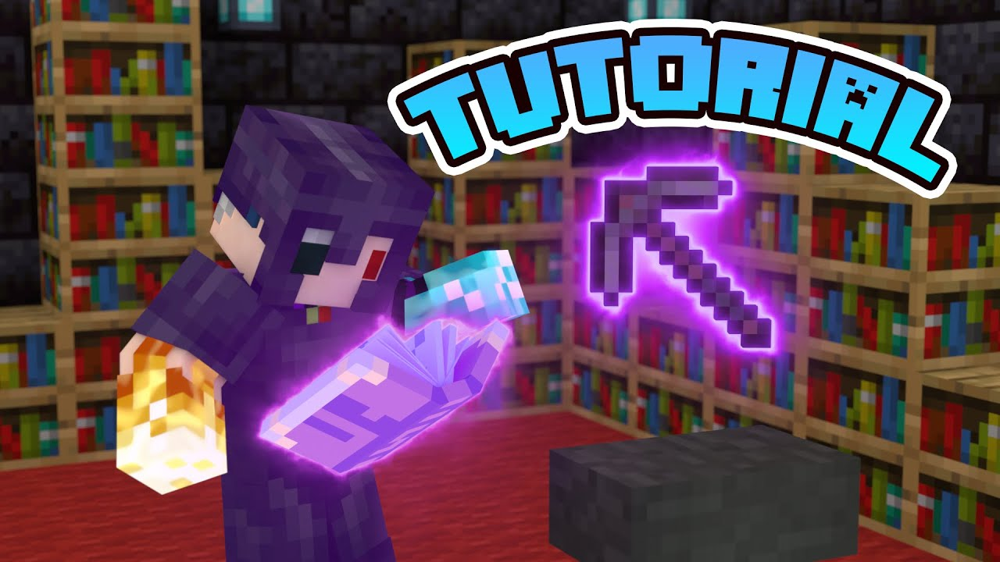
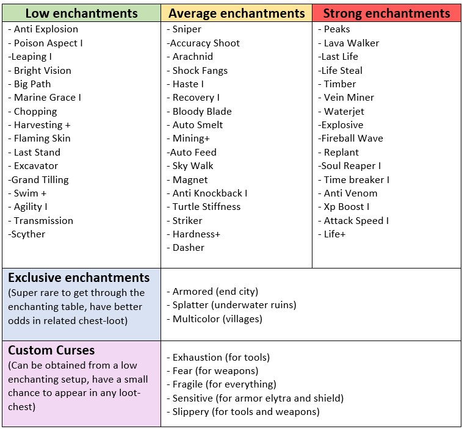

# Custom Enchantments

<figure><figcaption></figcaption></figure>



The enchanting setup is available in 3 tiers and each tier will get displayed by a lapis lazuli item that will start rotating on top of the enchanting table.

The higher the enchanting tier, the better enchantments you will get. There are some exclusive enchantments that can only be obtained at Tier 3.



Before start enchanting you need at least more than 30 xp levels and 1 lapis lazuli item in your inventory. These requirements are independent from the enchanting setup, meaning that even if you have a Tier 3 setup, you're limited by your levels and the amount of lapis you have.

Also, if you don't have an strong enchanting setup, no matter if you have tons of levels or lapis, you won't get strong enchantments if you don't upgrade your enchanting setup.



Once you have all the necessary requirements, you just need to drop a book on top of the enchanting table and a random enchanted book will appear. If you're very lucky, you may get a book with 3 custom enchantments at the same time.

You can also throw an enchantable item (like swords, boots or even shields) on top of the enchanting table to enchant that item with their compatible enchantments. You can also get more than one custom enchantment at once!

However, books and items can also get custom curses when using the enchanting table, so be careful.



* When enchanting items, you will also enchant them with vanilla enchantments.
* Items and Books can only the enchanted once, if you want to try again you can disenchant them.
* When using an enchanting setup, the lapis lazuli items on top the enchanting table will rotate faster.
* If the item had a custom Lore on it, when enchanting it will keep it's Lore + the new enchantments Lore.
* Although the enchantments are random, you can see the "rarity" of each one below



<figure><figcaption></figcaption></figure>
