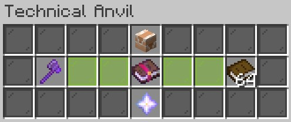

# Disenchanting

If you use the grindstone as normal with items with Custom Enchantments, it will only remove vanilla enchantments. But if you want to remove the custom enchantments:

Just drop the item on top of a grindstone and it will remove all the enchantments that you had. THIS WILL ALSO REMOVE VANILLA ENCHANTMENTS.

By doing this you can receive a bit of XP, depending on how many enchantments your item had and at what level they were.\
\
<mark style="color:yellow;">**Alternatively, you can use the TECHNICAL ANVIL EXTRACTING MODE:**</mark>\ <mark style="color:yellow;">****</mark>You need to place your item enchanted with custom enchantments in the left slot and normal books in the right slot. After that you can click on the nether star to remove that enchantment from your item and put it in a new enchanted book. This is 100% free

<figure><figcaption></figcaption></figure>

_<mark style="color:yellow;">**Note:**</mark> The enchantment that you are currently extracting may not be the first or last one in the item's Lore. <mark style="color:red;">You can't extract custom curses.</mark>_\
