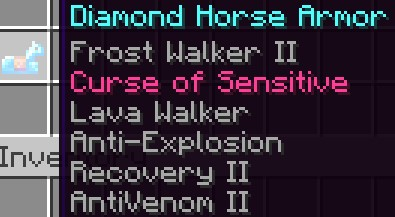

# Enchantments Description

<mark style="color:yellow;">**FOR THE TRIDENT**</mark>

<mark style="color:green;">**Poison Aspect:**</mark> Poisons the mob upon hitting it. Xp boost: When you kill mobs, you get more experience orbs. \
<mark style="color:green;">**Attack Speed:**</mark> Increases the attack speed of your weapon. \
<mark style="color:green;">**Marine Grace:**</mark> You have a chance to spin a mob that you hit. \
<mark style="color:green;">**Waterjet:**</mark> If you hit a mob or a player, it will be sent up through the air (doesn't work inside water).

<mark style="color:yellow;">**FOR THE SWORD**</mark>

<mark style="color:green;">**Anti-Explosion:**</mark> Creeper and tnt will not explode when you are near them with this enchantment. <mark style="color:green;">**Bloody Blade:**</mark> The more you kill, the stronger you get. It will reset if you don't kill for a while. \
<mark style="color:green;">**Poison Aspect:**</mark> Poisons the mob upon hitting it. \
<mark style="color:green;">**Life Steal:**</mark> Drains health of the target and gives it to the player. \
<mark style="color:green;">**Xp boost:**</mark> When you kill mobs, you get more experience orbs. \
<mark style="color:green;">**Attack Speed:**</mark> Increases the attack speed of your weapon. \
<mark style="color:green;">**Last Stand:**</mark> The lower hp you are, the stronger you get.

<mark style="color:yellow;">**FOR THE AXE**</mark>

<mark style="color:green;">**Haste:**</mark> Gives you the haste effect. \
<mark style="color:green;">**Auto Smelt:**</mark> With the axe, you can get charcoal when you mine logs, wood, stripped logs, and stripped wood. \
<mark style="color:green;">**Chopping:**</mark> With the axe, you can mine a 3x3 area of any type of wood or nether wood. \
<mark style="color:green;">**Striker:**</mark> Each time you do a critical hit, you will have a chance to trigger a row of lightning bolts to your target. \
<mark style="color:green;">**Timber:**</mark> Cut down an entire tree or nether tree (leaves and wart included). \
<mark style="color:green;">**Transmission:**</mark> Every time you hit a mob, it will have a small change to be randomly teleported. \
<mark style="color:green;">**Xp boost:**</mark> When you kill mobs, you get more experience orbs.

<mark style="color:yellow;">**FOR THE SHOVEL**</mark>

<mark style="color:green;">**Haste:**</mark> Gives you the haste effect. \
<mark style="color:green;">**Auto Smelt:**</mark> With the shovel, you can get terracotta or glass when you mine the correct block. <mark style="color:green;">**Excavator:**</mark> With the shovel, you can mine a 3x3 area any type of dirt, clay or sand. \
<mark style="color:green;">**Big path:**</mark> If you use a shovel to create a path block, it will generate a 3x3 path on the ground.

<mark style="color:yellow;">**FOR THE PICKAXE**</mark>

Haste: Gives you the haste effect. Auto Smelt: With the pickaxe, you can get ingots from ores, and many other blocks that can be smelted. Mining+: With the pickaxe, you can mine a 3x3 area any type of stone. Vein miner: Mines instantly a connected vein of ores.

<mark style="color:yellow;">**FOR THE HOE**</mark>

<mark style="color:green;">**Replant:**</mark> If you break any crop with this hoe (wheat, carrot, potato, beetroot or nether wart), it will plant it for you. \
<mark style="color:green;">**Grand Tilling:**</mark> If you use a hoe to till the land, it will create a 3x3 area of farmland. \
<mark style="color:green;">**Harvesting +:**</mark> Every 3 minutes you get random nature items, it varies depending on the dimension you're in. \
<mark style="color:green;">**Scyther:**</mark> Allows you to cut a 3x3 surface of any hoe related blocks and vegetation- \
<mark style="color:green;">**Soul Reaper:**</mark> While holding this hoe in the offhand, mobs around you will receive damage.

<mark style="color:yellow;">**FOR THE BOW**</mark>

<mark style="color:green;">**Anti-Explosion:**</mark> Creeper and TNT will not explode when you are near them with this enchantment. <mark style="color:green;">**Accuracy Shot:**</mark> Arrows are not affected by gravity. \
<mark style="color:green;">**Explosive:**</mark> Arrows explode when hit a mob or the ground. \
<mark style="color:green;">**Arachnid:**</mark> When the arrow hit a mob or the ground, it creates cobwebs around a mob and pulls it down to the ground.

<mark style="color:yellow;">**FOR THE CROSSBOW**</mark>

<mark style="color:green;">**Sniper:**</mark> The furthest the arrow travels, the more damage will deal (more than a Power V arrow). <mark style="color:green;">**Accuracy Shot:**</mark> Arrows are not affected by gravity. \
<mark style="color:green;">**Shock Fangs:**</mark> Arrows generate evoker fangs and apply the blindness effect when hit a mob or the ground. \
<mark style="color:green;">**Fireball Wave:**</mark> Arrows generate a ring of fireballs when hit a mob or the ground.

<mark style="color:yellow;">**FOR THE HELMET**</mark>

<mark style="color:green;">**Time breaker:**</mark> Will stunt mobs around you. For this to trigger you need to crouch for 4 seconds without leaving the floor. \
<mark style="color:green;">**Bright vision:**</mark> Gives night vision to the player. \
<mark style="color:green;">**Magnet:**</mark> Attract all items within 7 block radius around you. \
<mark style="color:green;">**Anti-Explosion:**</mark> Creeper and TNT will not explode when you are near them with this enchantment.

<mark style="color:yellow;">**FOR THE CHESTPLATE**</mark>

<mark style="color:green;">**Auto-feed:**</mark> Feeds you every 3 minutes. \
<mark style="color:green;">**Anti-venom:**</mark> Protects you against negative effects. \
<mark style="color:green;">**Life+:**</mark> Give the player extra hearts while wearing it. \
<mark style="color:green;">**Flaming Skin:**</mark> Creates a fire aura when taking too accumulating damage constantly.

<mark style="color:yellow;">**FOR THE LEGGINGS**</mark>

<mark style="color:green;">**Swim+:**</mark> Gives the player the dolphin grace effect. Leaping: Makes the player jump higher. \
<mark style="color:green;">**Last life:**</mark> When your HP is low, Last Life heals you with 5 minutes of cooldown. \
<mark style="color:green;">**Recovery:**</mark> If you take too much damage, you can regenerate faster.

<mark style="color:yellow;">**FOR THE BOOTS**</mark>

<mark style="color:green;">**Agility:**</mark> Give the player more speed while wearing it. \
<mark style="color:green;">**Lava walker:**</mark> Allows the player to walk on lava. \
<mark style="color:green;">**Sky walk:**</mark> If there are 5 air blocks down you, you'll start to fly and if you press the "Sneak" key you go down. \
<mark style="color:green;">**Dasher:**</mark> If you sprint for 5 seconds straight, you generate a trail that will damage nearby mobs.

<mark style="color:yellow;">**FOR THE SHIELD**</mark>

<mark style="color:green;">**Anti-Knockback:**</mark> Reduces the knockback that you receive. You can almost ignore knockback with a full netherite armor while holding this shield. \
<mark style="color:green;">**Hardness+:**</mark> Gives you extra armor toughness. \
<mark style="color:green;">**Peaks:**</mark> Each time you block an attack from a mob, that mob will receive a bit of damage. \
<mark style="color:green;">**Turtle Stiffness:**</mark> If you block an attack while crouching, you summon turtle shells that will protect you from nearby enemies and any projectiles for 10 seconds.

<mark style="color:yellow;">**EXTRA**</mark>

<mark style="color:green;">**Multicolor (shears):**</mark> Every time you shear a sheep, you have a random chance to get any wool color. (See more details on the Guide).

<mark style="color:green;">**Armored (elytra):**</mark> You get extra armor points, but less than diamond gear. (See how you can obtain it on the Guide).

<mark style="color:green;">**Splatter (fishing rod):**</mark> Equip this fishing rod in your offhand to shoot a powerful beam that ignores armor. However this will damage your rod. (See more details in the Guide).

<mark style="color:green;">**Horse Armor:**</mark> You can apply some of these custom enchantments to any horse armor, including frost walker! See it here:

<figure><figcaption></figcaption></figure>
