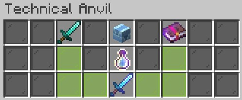

# Technical Anvil

In order to apply custom enchantments, please see instructions below.\
\
Crafting the "technical anvil" is as simple as throwing an <mark style="color:green;">**Undamaged Anvil**</mark> on top of an enchanting table while having <mark style="color:blue;">**8 blocks of lapis lazuli**</mark> in your inventory. Once you have achieved this you can place it down anywhere in the world and interact with it to open it's UI as shown below.

<figure><figcaption></figcaption></figure>

The UI behaves exactly as a normal anvil, however this is the only way to combine custom enchantments to items and books. \
If the combination is valid, just click on the experience bottle to confirm this action. Once you do that, you will get the newly enchanted item in your inventory\
\
To remove a technical anvil, just break the slab hitbox.\
\
It may also be possible to merge two same items in order to combine their enchantments into one single item. (for this you will need to have 30 exp levels) this only applies for custom enchanted books and not the vanilla ones.&#x20;

