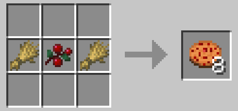

# More Food

To see the custom food items, you will need this resource pack below. \
\
<mark style="color:yellow;">**Install Resource Pack - Via your Launcher**</mark>\
****step **** a**,** Click on Options\
step b, Followed by Resource Packs\
step c, Open Pack Folder\
step d, And place the .zip folder inside it (DO NOT UNZIP)\
****\
****<mark style="color:orange;">**Install Resource Pack - Via your PC**</mark>\
****step **** a**,** Click on the search icon\
step b, Type in %appdata%\
step c, click on .minecraft\
step d, click on the folder - resourcepacks\
step e, and drop the .zip file in there (DO NOT UNZIP)\
****



\
With this new feature added to the server on a trial basis. Users can now craft some more food. \
\
You can now enjoy the following

Fruits (12)

* Pear: Chance to drop out of Birch Leaves
* Cherry: Chance to drop out of Dark Oak Leaves
* Orange: Chance to drop out of Acacia Leaves
* Lemon: Chance to drop out of Acacia Leaves
* Banana: Chance to drop out of Jungle Leaves
* Mango: Chance to drop out of Jungle Leaves
* Carambola: Chance to drop out of Azalea Leaves
* Pitaya: Chance to drop out of Flowering Azalea Leves
* Purple Grapes: Chance to drop out of Vines
* Green Grapes: Chance to drop out of Vines
* Pineapple: Chance to drop out of Fern in Jungle Biomes
* Blueberries: Chance to drop out of Fern in Taiga Biomes (not Snowy Taiga)

Vegetables (2)

* Tomato: Rightclick a Tomato Plant
* Corn Cob: Chance to drop out of Tall Grass in Plains or Sunflower Plains Biome

Plants (1)

* Tomato Plant: Find some Tomato Seeds in a Shipwreck Supply Chest, plant it on dirt

### Food Crafting



<figure><figcaption></figcaption></figure>



<figure><figcaption></figcaption></figure>



<figure><figcaption></figcaption></figure>



<figure><figcaption></figcaption></figure>





<figure><figcaption></figcaption></figure>



<figure><figcaption></figcaption></figure>



<figure><figcaption>
THIS IS THROWABLE
</figcaption></figure>



<figure><figcaption></figcaption></figure>


