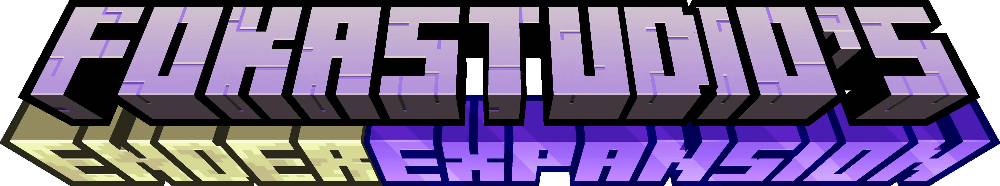
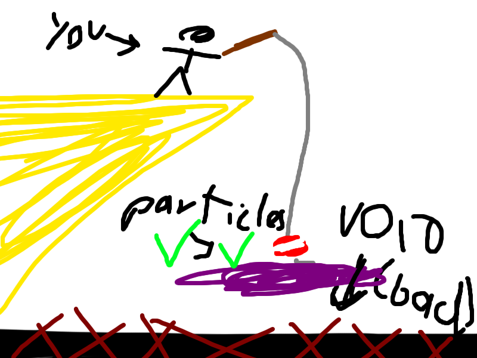

# Server Description

Do you enjoy playing Vanilla Minecraft but often feel it gets a little stale and boring with the same old biomes and terrain? Then welcome to 1Blockoff. Read below for what our server focuses on.



Slimefun is a plugin that aims to enhance or modernize many different aspects of gameplay. Adding in over 500+ items and new features such as jetpacks, programmable androids, cargo, energy and electricity, magical Armor & items and much more. \
\
We are currently in the process of adding some officially supported addons which will vastly improve the quality of the server as well as adding in even more new items for you to research, unlock and explore.&#x20;



For many years we used the Lands plugin for our land protection, However we feel that with the changes the developer has been making recently this plugin is slowly going down the toilet, not to mention the pathetic support that is very much non existent, even after providing proof of purchase they still won't verify us in the discord. So I have now decided to stop using all of his plugins (this includes ChestProtect). \
\
Towny is our new official land protection plugin, it will allow you to create a town, which in turn you can invite other players to (providing you meet the requirements) The owner of the town is called a Mayor, whilst the members of a town are called its residents.\
\




<figure><figcaption></figcaption></figure>

Terralith adds over 85+ new biomes, and updates nearly all of the biomes from the orignal version with new and improved features. It also includes a ton of new terrain such as canyons, fragmented biomes, floating islands, deep ocean trenches and much more. \
\
The style of Terralith is designed to appeal to everyone. There are plenty of realistic biomes like Yellowstone, Shield, and Highlands, but also fantastic places like the Skylands, Moonlight Grove, and even the elusive Mirage Isles. You’ll never run out of new biomes and experiences to discover.\

<figure><figcaption></figcaption></figure>


Resource Pack: [**Incendium\_Optional\_RP\_5.5.zip**](https://github.com/Stardust-Labs-MC/downloads-library/raw/main/Incendium/Resource%20Pack/Incendium\_Optional\_RP\_5.5.zip)****\
****_this resource pack is optional, however if you wish to see the custom items as intended then this pack is highly recommended._


With Incendium you can find 8 new Biomes, which spawn alongside the already existing ones. It’s also worth nothing that the height of the Nether has been increased to 192 blocks high, making the terrain much better.

The Biomes that you can find are the Ash Barrens, Infernal Dunes, Inverted Forest, Quartz Flats, Toxic Heap, Volcanic Deltas, Weeping Valley and Withered Forest.\
\
There is also around 10 structures included by Incendium in its current form. These are of all different sizes, with some being bigger than any other structure that currently exists in Minecraft.\
\
You can find the Abandoned Tower, Forbidden Castle, Infernal Altar, Nether Reactor, Piglin Village, Pipeline, Quartz Kitchen, Ruined Lab and the Sanctum. While a small amount of these structures don’t offer a lot to do, some are like complete dungeons, taking a long time to fully explore.

The largest has to be the Forbidden Castle, which is full of hostile Piglins, some of which are wearing Armor. But in most of these structures, you can find lots of loot too, if you can safely retrieve it. Make sure to search every Barrel and Chest you come across.

<figure><figcaption></figcaption></figure>

This expansion overhauls the entire end dimension in a way that is both spectacular and unique.\
\
In addition to the 5 Vanilla biomes which has been revamped, There is also 17 new biomes for you to explore and experience. \
\
There is also a couple of new structures that generate all over the end, Massive overhaul to the shape of the End islands (which means the end of the boring ugly looking vanilla ones) End cities & Strongholds have also been revamped.  For more information see the tab below for what you can expect




| <mark style="color:purple;">**Amethyst Forest**</mark> - name is kinda self-explanatory. Generates a lot of Geodes and random Amethyst. Looks kinda like from a dream                                                                                                               |
| ----------------------------------------------------------------------------------------------------------------------------------------------------------------------------------------------------------------------------------------------------------------------------------- |
| <mark style="color:purple;">**Warped Marsh**</mark> - consider it a mix of Warped Forest, Swamp and Lush Caves - it can provide you with Food, and most of the time - safety                                                                                                        |
| <mark style="color:purple;">**Flesh Tundra**</mark> - this biome is actually creepy, if you actually start to think that this is actual flesh. Cold Wasteland, filled with random Ribs and Columns made out of nothing, but Bones....                                               |
| <mark style="color:purple;">**The Nest**</mark> - consists of large Deepslate Hills (they can get really steep sometimes!), generates loads of Ores, but it is also very dangerous!                                                                                                 |
| <mark style="color:purple;">**End Wilds**</mark> - despite looking appealing and cozy, this biome is even more deadly than any other one.                                                                                                                                           |
| <mark style="color:purple;">**Ashfall Deltas**</mark> - mix between Basalt Deltas and Swamp. The most deadly biome out of all, sice it spawns a lot of Wither Skeletons and Guardians.                                                                                              |
| <mark style="color:purple;">**Ender Waste**</mark> - whatever has happened here, it is better that we don't know that...                                                                                                                                                            |
| 
<mark style="color:purple;"><strong>The Void</strong></mark> - devoid of life, this biome is found only in the deepest regions of this dimension 
                                                                                                                         |
| <mark style="color:purple;">**Blazing Dunes**</mark> - ever thought of how would a mix of Nether and The End look like? Yeah, me neither... Good part is that a lot of Piglins spawn here, so they can provide you with some equipment and resources in exchange for Gold.          |
| <mark style="color:purple;">**Chorus Jungle**</mark> - dense vegetation blocks the view, altough it is way more safe than it looks like.                                                                                                                                            |
| <mark style="color:purple;">**Shattered End**</mark> - those are the Remnants of the Great Ender War...                                                                                                                                                                             |
| <mark style="color:purple;">**Glowshroom Valley**</mark> - kingdom of flickering lights and giantic Fungi. This is your only safehouse in The End, as no mobs can spawn there. But it is also picky in terms of food...                                                             |
| <mark style="color:purple;">**Frosted Hills**</mark> - frozen wasteland, filled to the brim with Phantoms that seem to love the cold. You can also consider this a variant of End Barrens                                                                                           |
| <mark style="color:purple;">**Snowy Warped Forest**</mark> - what kind of disaster has swept this biome?! It looked so lovely in The Nether...                                                                                                                                      |
| <mark style="color:purple;">**Prismarine Forest**</mark> - variant of Amethyst Forest, but as the name suggests, it is made out of Prismarine... Watch out for the Creepers, they really do seem to love humid landscapes                                                           |
| <mark style="color:purple;">**The Hallow**</mark> - allegory of purity taken to the absolute extremes. It is said that a vengeful fae goddes resides here, whose only goal is to purify the world of all that is impure.                                                            |
| <mark style="color:purple;">**Sculk Growth**</mark> - a cancerous-like growth in the deeper parts of The End. It is unclear how it made it here from the Overworld. Perhaps someone carried and spread it on purpose...?                                                            |
| <mark style="color:purple;">**End Highlands**</mark> <mark style="color:purple;"></mark><mark style="color:purple;"></mark> - The Dragon's Gardens, or at least it seems like it. Many Hoglins made their way there, so you can start to gather food different than Chorus Flowers. |
| <mark style="color:purple;">**End Midlands**</mark> - the second most safe Biome. How about a small walk on the Fields of Hopes and Dreams?                                                                                                                                         |
| <mark style="color:purple;">**Small End Islands**</mark> - the gravity never meant anything in Minecraft, The End doesn't obey it as well...                                                                                                                                        |
| <mark style="color:purple;">**End Barrens**</mark> - the true definition of The End - plain wasteland, filled with nothing, nothing, and nothing...                                                                                                                                 |
| <mark style="color:purple;">**The End**</mark> - mashup of all original End biomes - this place is one big mess and chaos                                                                                                                                                           |



| <mark style="color:orange;">**Dragonblade**</mark> - the mighty sword found in the Dragon's Den. Only one generates per world. On attack, leaves a cloud of debuffs at your victim + increases damage for your next attack |
| -------------------------------------------------------------------------------------------------------------------------------------------------------------------------------------------------------------------------- |

| <mark style="color:orange;">**Shulker Armor**</mark> - upgrade of Netherite Armor. Throw a Netherite armor piece alongside 15 (NOTE TO SELF: 16 in upcoming update) Shulker Shells onto and Altar of The Accursed located in a pit in the Dragon's Den. Increases defense even further beyond what Netherite Armor grants, but decreases speed and attack capabilities. A full set also provides immunity to Levitation and summons up to 3 Shulker Bullets that seek out your enemies when you are hit. |
| -------------------------------------------------------------------------------------------------------------------------------------------------------------------------------------------------------------------------------------------------------------------------------------------------------------------------------------------------------------------------------------------------------------------------------------------------------------------------------------------------------- |

| <mark style="color:orange;">**Ancient Armor**</mark> - found in End Cities and Ender Crates. Defensive stats are comparable to the ones of Diamond Armor, but each piece increases your damage and attack speed. Full set grants additional 50% increased damage for a grant total of 80% increase. |
| --------------------------------------------------------------------------------------------------------------------------------------------------------------------------------------------------------------------------------------------------------------------------------------------------- |

| <mark style="color:orange;">**Hallowed Armor**</mark> - found in End Cities, Hallowed Crates and as a Void Fishing drop in The Hallow. Defensive stats are a bit lower than the ones of Diamond Armor, but each piece increases your movement speed as well as maximum health. Full set grants you the Holy Protection buff every 20 seconds that allows you to completely negate damage of a few next hits, as well as give you an burst of speed to help you escape the dangers.                            |
| ------------------------------------------------------------------------------------------------------------------------------------------------------------------------------------------------------------------------------------------------------------------------------------------------------------------------------------------------------------------------------------------------------------------------------------------------------------------------------------------------------------- |
| 
<mark style="color:orange;"><strong>Ender Insignia</strong></mark> - increases your life regen when held in either hand AND not moving. (by 6 HP/s) Dropped by Ender Dragon
                                                                                                                                                                                                                                                                                                                         |
| <mark style="color:orange;">**Living Flesh**</mark> - rarely found in Ender Monster Rooms, fished up in Flesh Tundra or found in Hematic Crates. Lowers your Damage for 30 seconds, but provides immense life regeneration (20 HP/s)                                                                                                                                                                                                                                                                          |
| 
 <mark style="color:orange;"><strong>Sharanga</strong></mark> - legendary bow used only by the greatest Illusioners.  Rarely drops from Illusioners inside Strongholds (respects Looting enchant). Converts Spectral Arrows into powerful Spectral Bolts. These are able to pierce up to 20 enemies, do not obey gravity and explode upon impacting a block or despawning. Spectral Bolts naturally disappear after a second, but this is still enough to travel over 50 blocks. 
 |
| 
<mark style="color:orange;"><strong>Clockwork Crossbow</strong></mark> - various mechanics turned this weapon intoto a semi-auto Crossbow.  Rare drop from Pillagers inside Strongholds (again, chances are increased with Looting). Fires just as quickly as you can click, but arrows deal less damage and are stripped of all special properties.  Has a 33% chance to not consume arrows.
                                                                                           |




| 
<mark style="color:purple;"><strong>Void Fishing</strong></mark> - cast your lure into the deep depths of The Void in The End and wait! You should be able to fish out either a species that has never been documented before, or some precious loot, like Crates. Crates can be fished out in all biomes, and some of them even have their own unique Crates! Each Crate contains some loot you can find in End Cities!  <mark style="color:green;"><strong>HOW TO VOID FISH - DEMO</strong></mark> 
 |
| ------------------------------------------------------------------------------------------------------------------------------------------------------------------------------------------------------------------------------------------------------------------------------------------------------------------------------------------------------------------------------------------------------------------------------------------------------------------------------------------------------------------------------------------------------------------------- |
| <mark style="color:purple;">**Altar of The Accursed**</mark> - new crafting station found in Dragon's Den. Currently its only purpose is to craft powerful Shulker Armor                                                                                                                                                                                                                                                                                                                                                                                                  |
| <mark style="color:purple;">**Crystals Left Bossbar**</mark> - the amount of crystals you still have to destroy is displayed below Dragon's HP bossbar. a QOL change                                                                                                                                                                                                                                                                                                                                                                                                      |



| 
<mark style="color:purple;"><strong>End Cities</strong></mark> - yes, I know that it is a vanilla structure, but it has been overhauled!
<ul><li>Changing the Banners on the towers to a new design.</li><li>Adding so-called Shulker Sentries, which are spawners that create Shulker Bullets that target you no matter what.</li><li>Putting some extra chests in some places for extra loot.</li><li>Making the Shulkers from the Spawners sometimes spawn with random colors (not every spawner is affected)</li></ul> |
| -------------------------------------------------------------------------------------------------------------------------------------------------------------------------------------------------------------------------------------------------------------------------------------------------------------------------------------------------------------------------------------------------------------------------------------------------------------------------------------------------------------------------------- |

| 
<mark style="color:purple;"><strong>Strongholds</strong></mark> - Stronghold generation has been COMPLETELY CHANGED 🎉🎉  They now generate deeper and are themed after Illagers. They are now have more long corridors and even more rooms with loot to find! The overall size of them has also been increased, as the largest one I was able to find had its ends over 200 blocks away from its center!  Illagers are able to spawn there naturally with tweaked loot tables. More chests generate and they contain far more valuable loot. As an exhange, enemies inside Strongholds have been empowered a little. Strongholds are now considered pre-endgame structure that you should really prepare for.  Stronghold generation works with all biome packs, including (but not limited to) ones like Terralith! 
 |
| ----------------------------------------------------------------------------------------------------------------------------------------------------------------------------------------------------------------------------------------------------------------------------------------------------------------------------------------------------------------------------------------------------------------------------------------------------------------------------------------------------------------------------------------------------------------------------------------------------------------------------------------------------------------------------------------------------------------------------------------------------------------------------------------------------------------------------------------------------- |

| <mark style="color:purple;">**Dragon's Den**</mark> - central Island of The End also got a makeover! It now generates a large middle pillar where the exit portal is located, and a lot of smaller ones around it. More Crystalls are caged, and under the main pillar is a giant pit, where you can find a Dragonblade stuck in the Altar of The Accursed - a new crafting station. Enemies killed nearby the Altar cause Sculk to spread. |
| ------------------------------------------------------------------------------------------------------------------------------------------------------------------------------------------------------------------------------------------------------------------------------------------------------------------------------------------------------------------------------------------------------------------------------------------- |

| <mark style="color:purple;">**Return Gateways**</mark> - return Gateways in The End have also been rehauled - they have 10 new designs, with different ones spawning in different biomes. They can also be located by throwing an Eye of Ender in The End, in case you got lost. |
| -------------------------------------------------------------------------------------------------------------------------------------------------------------------------------------------------------------------------------------------------------------------------------- |




End Cities can currently spawn in the following biomes: \
\
End Highalnds \
The End (biome) \
End Midlands \
The Hallow \
End Barrens \
Chorus Jungle \
End Wilds \
Ender Waste \
Warped Marsh \
Frosted Hills \
Prismarine and Amethyst Forest \
Snowy Warped Forest

