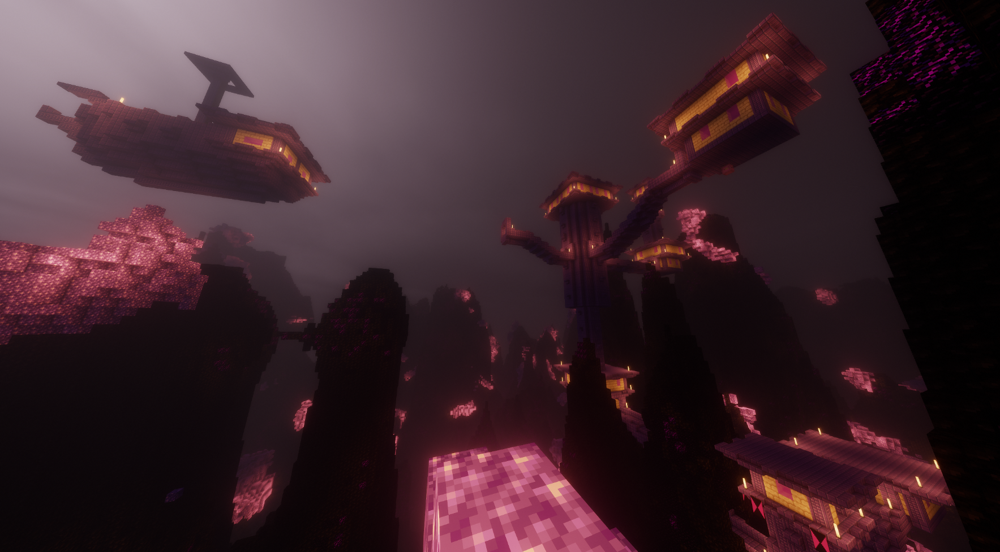
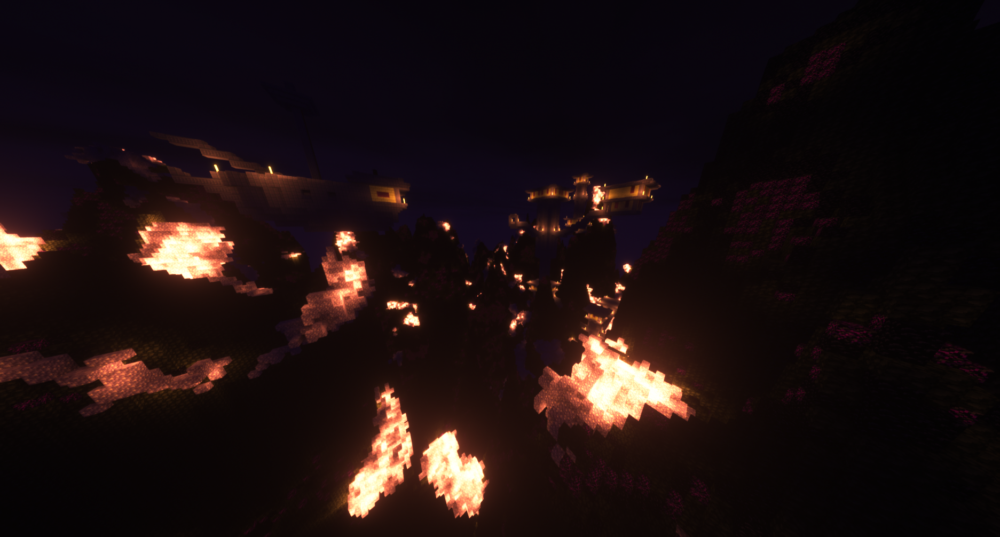
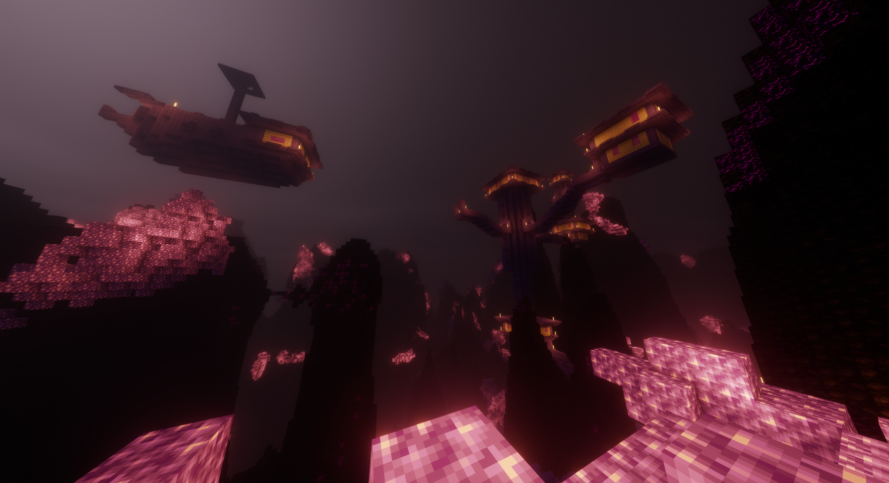
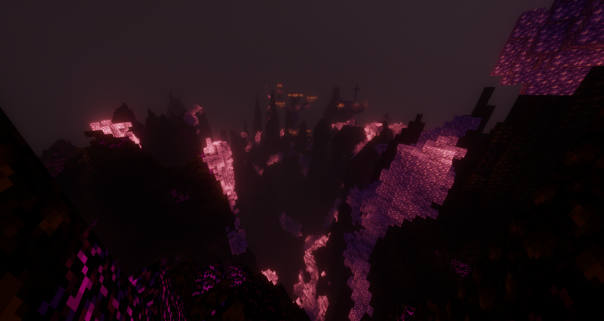
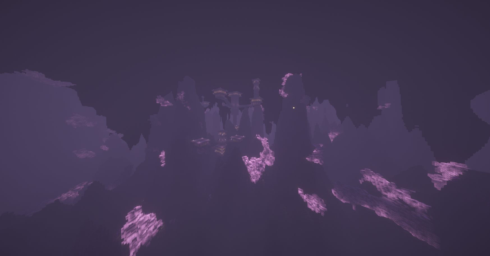

# Showcase


Would you like to contribute to your showcase? \
\
\- Take screenshots in F1 mode\
\- Send to me on discord\
\- I will then upload to the wiki (full credit giving to the user)\
\
All screenshots must clear from texts, slot bars, inventory etc.&#x20;


## Overworld

## The End

Here is a few screenshots taking by some of our users to showcase what our biomes look like, eventually i will switch this over to a nice gallery so we can all enjoy

<figure><figcaption>
Credits: noxidevad
</figcaption></figure>

 

<figure><figcaption>
Credits: TheToxicBigFoot
</figcaption></figure>

 

<figure><figcaption>
Credits: TheToxicBigFoot
</figcaption></figure>

 

<figure><figcaption>
Credits: TheToxicBigFoot
</figcaption></figure>

 

<figure><figcaption>
Credits: TheToxicBigFoot
</figcaption></figure>

 

<figure><figcaption>
Credits: TheToxicBigFoot
</figcaption></figure>

 

<figure><figcaption>
Credits: TheToxicBigFoot
</figcaption></figure>

## The Nether
