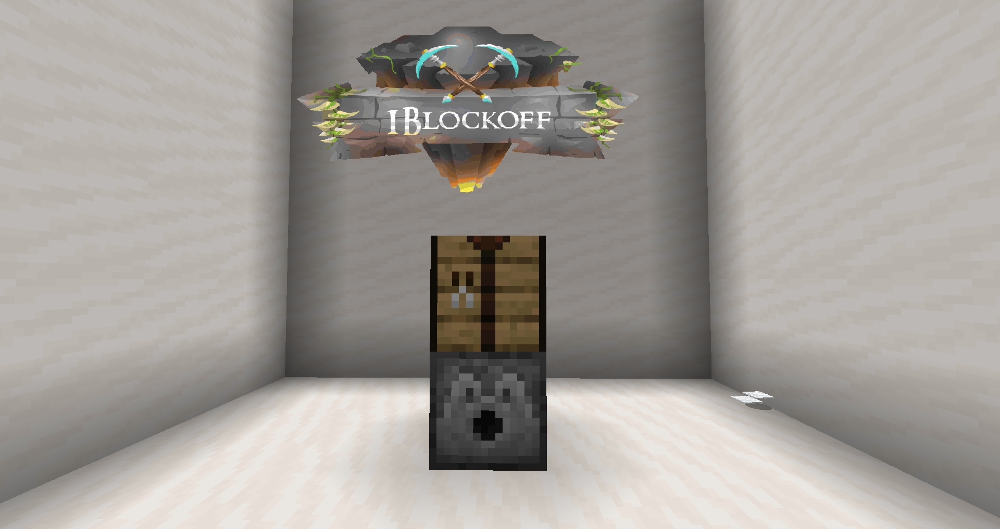
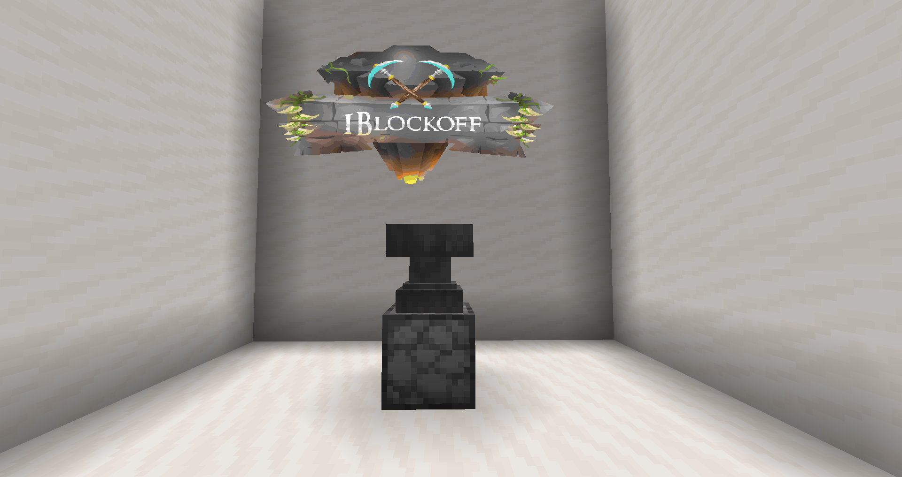
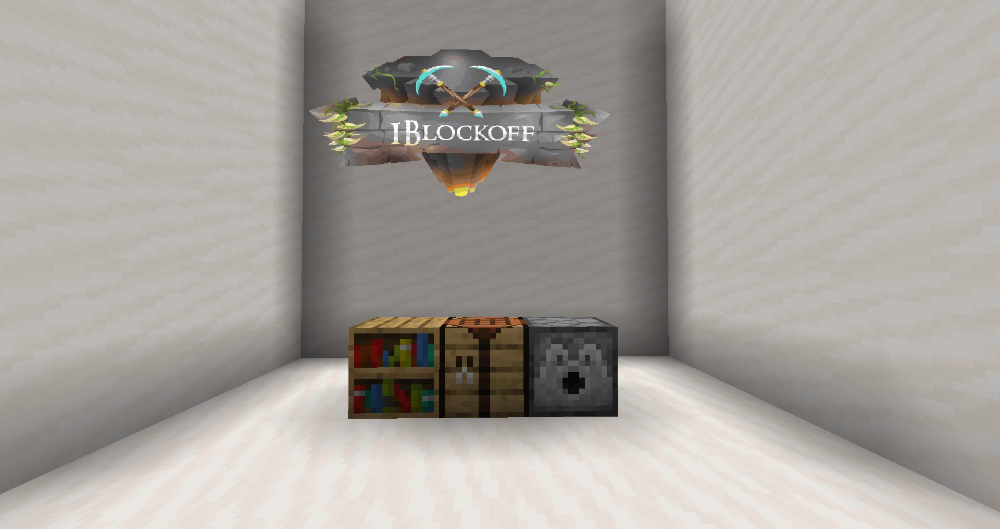

# Crafting

Basic machines are the corner stone of Slimefun production. Most of them are necessary in order to advance to higher tiers of Slimefun. Most of them only need a correct recipe in order to operate.

Mutli-block machines are machines that consist of multiple blocks which have to be placed down vertically in the world, as shown in the Slimefun guide.

_<mark style="color:green;">keep in mind that machines that process items individually, prioritize them from left to right and top to bottom.</mark>_

## Enhanced Crafting Table


The Enhanced crafting table is a multi-block, basic Slimefun Machine


<figure><figcaption></figcaption></figure>



The Enhanced Crafting Table is a crafting table specifically for general Slimefun recipes



Place items in the correct pattern of a recipe inside the Dispenser as shown in the Slimefun guide, Right click on the crafting table



<mark style="color:green;">**Recipe Chest:**</mark> You can also place a normal, single chest next to the dispenser of this machine, to automatically move any crafted items into the chest



## Armor Forge


An Armor Forge needs to be created with a <mark style="color:orange;">**non-damaged**</mark>** ** anvil. The anvil is not damaged when the machine is operated


<figure><figcaption>
Dispenser is facing upwards
</figcaption></figure>



The Armor Forge is exclusively used to craft armor pieces that are available through Slimefun



Place items in the correct pattern of a recipe inside the Dispenser as shown in the Slimefun guide, Right click on the Anvil.



<mark style="color:green;">**Recipe Chest:**</mark> You can also place a normal, single chest next to the dispenser of this machine, to automatically move any crafted items into the chest



## Magic Workbench


The magic workbench is a multi-block, basic Slimefun machine


<figure><figcaption></figcaption></figure>



The Magic workbench is exclusively used to craft Magic Items and gear in Slimefun



Place items in the correct pattern of a recipe inside the Dispenser as shown in the Slimefun guide, Right click on the Crafting table.



<mark style="color:green;">**Recipe Chest:**</mark> <mark style="color:green;"></mark><mark style="color:green;"></mark> You can also place a normal, single chest next to the dispenser of this machine, to automatically move any crafted items into the chest


