# Resource Processing

## Industrial Miners


The Industrial miner is a multi-block, basic Slimefun machine\
\
You have to put fuel in the chest before it is able to start working, more info on each fuel can be found in the Slimefun Guide


<figure>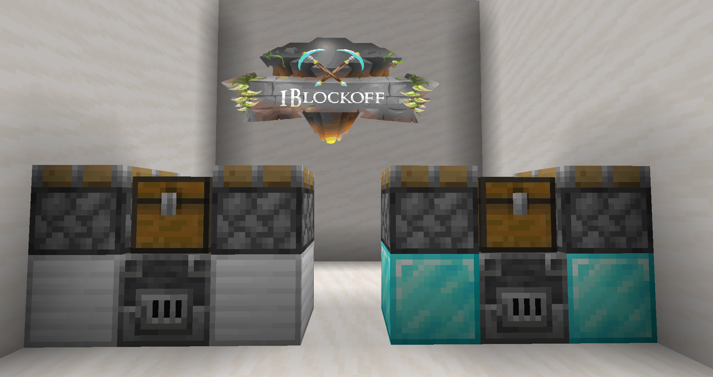<figcaption></figcaption></figure>

|           Miner           |      Fueled by      |  Area |
| :-----------------------: | :-----------------: | :---: |
|      Industrial Miner     |    Burnable items   |  7x7  |
| Advanced Industrial Miner | Bucket of Lava/Fuel | 11x11 |



The Industrial miners mines ore from the chunk it is placed in, and then crushes them to their products



Right click on the chest



|      ORE      |     OUTPUT    |
| :-----------: | :-----------: |
|      Coal     |      Coal     |
|    Diamond    |    Diamond    |
|    Emerald    |    Emerald    |
|      Gold     |   Gold dust   |
|      Iron     |   Iron dust   |
|  Lapis Lazuli |  Lapis Lazuli |
|  Nether Gold  |   Gold dust   |
| Nether Quartz | Nether quartz |
|    Redstone   |    Redstone   |

_<mark style="color:yellow;">Ancient debris is the only ore not mined by the industrial miners ;)</mark> _&#x20;

## Automated Panning Machine


The Automated panning machine is a multi-block, basic Slimefun machine


<figure>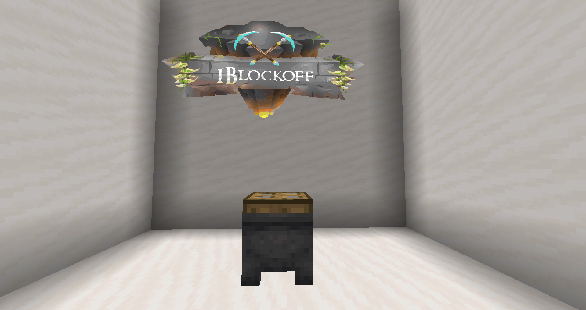<figcaption></figcaption></figure>



The Automated panning machine sifts gravel and soul sand into various important and valuable resources, the main of which being Sifted ore (used to craft dusts). It is the non-portable, machine counterpart of the Gold pan and the Nether gold pan combined.



Hold gravel in your main hand and then right click on the oak trapdoor

_this machine has no inventory so it will drop the items after processing._



<mark style="color:green;">**Recipe Chest:**</mark>** ** You can place a normal, single chest next to the cauldron of this machine, to automatically move any crafted items into the chest



Each of the 4 gravel products has a random % chance of dropping. In order of most common to least common product. Flint is the most common item followed by Sifted ore, then clay and least common is iron nugget.&#x20;

Each of the 5 soul sand products also has a random % chance of dropping. In order most most common to least common product. Nether quartz is the most common followed by glowstone dust, then blaze powder and least common is Ghast tear



|   INPUT   |     OUTPUT     |
| :-------: | :------------: |
|   Gravel  |      Flint     |
|   Gravel  |   Sifted Ore   |
|   Gravel  |      Clay      |
|   Gravel  |   Iron nugget  |
| Soul Sand |  Nether quartz |
| Soul Sand | Glowstone dust |
| Soul Sand |  Blaze Powder  |
| Soul Sand |   Nether wart  |
| Soul Sand |   Ghast tear   |

## Composter


The Composter is a single-block, basic Slimefun machine\
It must be crafted in the <mark style="color:blue;">Enhanced Crafting Table</mark>


|     -    |  RECIPE  |     -    |
| :------: | :------: | :------: |
| OAK SLAB |     X    | OAK SLAB |
| OAK SLAB |     X    | OAK SLAB |
| OAK SLAB | CAULDRON | OAK SLAB |



The Composter can convert materials into other, related materials



Hold the required items, Crouch and right click on the machine

_This machine has no inventory, It drops items are after processing_



<mark style="color:green;">**Recipe Chest:**</mark>** ** You can place a normal, single chest next to the cauldron of this machine, to automatically move any crafted items into the chest



|           INPUT           |    OUTPUT   |
| :-----------------------: | :---------: |
|          4 Wheat          | Nether wart |
|           2 Sand          |  Soul sand  |
|          4 Stone          |  Netherack  |
|         4 Andesite        |  Netherack  |
|         4 Diorite         |  Netherack  |
|         4 Granite         |  Netherack  |
|        8 Oak leaves       |     Dirt    |
|      8 Spruce leaves      |     Dirt    |
|       8 Birch leaves      |     Dirt    |
|      8 Jungle leaves      |     Dirt    |
|      8 Acacia leaves      |     Dirt    |
|     8 Dark oak leaves     |     Dirt    |
|      8 Azalea leaves      |     Dirt    |
| 8 Flowering azalea leaves |     Dirt    |
|       8 Oak saplings      |     Dirt    |
|     8 Spruce saplings     |     Dirt    |
|      8 Birch saplings     |     Dirt    |
|     8 Jungle saplings     |     Dirt    |
|     8 Acacia saplings     |     Dirt    |
|    8 Dark oak saplings    |     Dirt    |
|     8 Azalea saplings     |     Dirt    |
|     8 Flowering azalea    |     Dirt    |

## Compressor


The Compressor is a multi-block, basic Slimefun machine


<figure>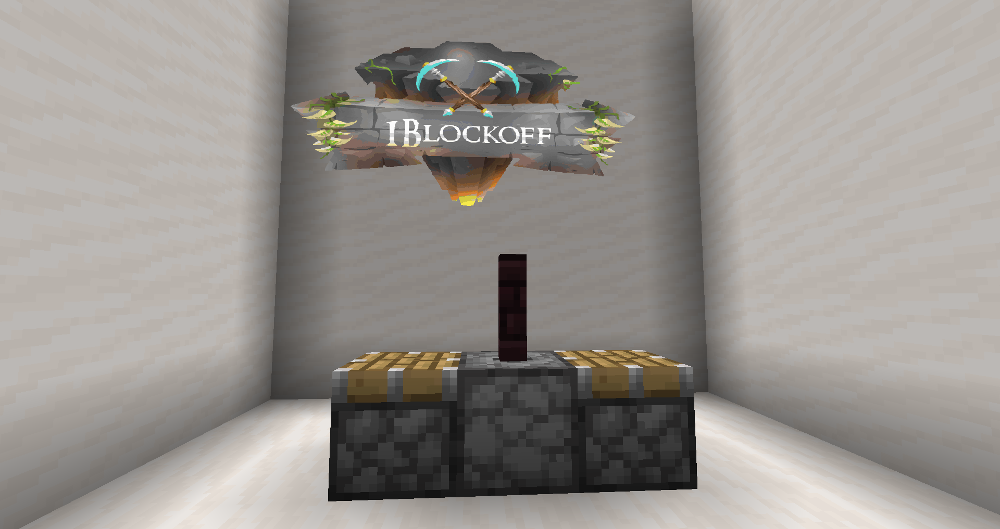<figcaption>
Dispenser is facing upwards
</figcaption></figure>



The Compressor is used specifically for compacting resources and byproducts



Place the items of a recipe inside the dispenser. Right click on the fence.The Compressor is used specifically for compacting resources and byproductsThe Compressor is used specifically for compacting resources and byproductsThe Compressor is used specifically for compacting resources and byproductsThe Compressor is used specifically for compacting resources and byproductsThe Compressor is used specifically for compacting resources and byproducts



<mark style="color:green;">**Recipe Chest:**</mark>** ** You can place a normal, single chest next to the cauldron of this machine, to automatically move any crafted items into the chest



|              INPUT             |       OUTPUT      |
| :----------------------------: | :---------------: |
|          4 Stone chunk         |    Cobblestone    |
|             8 Flint            |       Gravel      |
|           4 Charcoal           |        Coal       |
|        4 Charcoal Block        |     Coal block    |
|             8 Coal             |       Carbon      |
|            4 Carbon            | Compressed carbon |
|         8 Block of Coal        |      9 Carbon     |
|          8 Steel ingot         |    Steel plate    |
| 8 Reinforced alloy steel ingot |  Reinforced plate |

## Crucible


The Crucible is a single-block, basic Slimefun macine\
It must be crafted in the <mark style="color:blue;">Enhanced Crafting Table</mark>


|      -     |     RECIPE    |      -     |
| :--------: | :-----------: | :--------: |
| Terracotta |       X       | Terracotta |
| Terracotta |       X       | Terracotta |
| Terracotta | Flint & Steel | Terracotta |



The Crucible turns certain blocks into Water or Lava.



Hold the required items, right click on the machine

_This machine has no inventory, It drops items are after processing_

A Water or Lava source block will be placed above it after the blocks are processed. It is recommended to encase the block above the Crucible so that the Water or Lava does not flow.



<mark style="color:green;">**Recipe Chest:**</mark>** ** You can place a normal, single chest next to the cauldron of this machine, to automatically move aHold the required items, right click on the machine

_This machine has no inventory, It drops items are after processing_

A Water or Lava source block will be placed above it after the blocks are processed. It is recommended to encase the block above the Crucible so that the Water or Lava does not flow.Hold the required items, right click on the machine

_This machine has no inventory, It drops items are after processing_

A Water or Lava source block will be placed above it after the blocks are processed. It is recommended to encase the block above the Crucible so that the Water or Lava does not flow.ny crafted items into the chest



|            INPUT           | OUTPUT |
| :------------------------: | :----: |
|       16 Cobblestone       |  Lava  |
|        16 Netherack        |  Lava  |
|          12 Stone          |  Lava  |
|          12 Basalt         |  Lava  |
|    12 Cobbled deepslate    |  Lava  |
|        10 Deepslate        |  Lava  |
|           8 Tuff           |  Lava  |
|        8 Blackstone        |  Lava  |
|          Obsidian          |  Lava  |
|        12 Terracotta       |  Lava  |
|     12 White terracotta    |  Lava  |
|    12 Orange terracotta    |  Lava  |
|    12 Magenta terracotta   |  Lava  |
|  12 Light blue terracotta  |  Lava  |
|    12 Yellow terracotta    |  Lava  |
|     12 Lime terracotta     |  Lava  |
|     12 Pink terracotta     |  Lava  |
|     12 Gray terracotta     |  Lava  |
|  12 Light gray terracotta  |  Lava  |
|     12 Cyan terracotta     |  Lava  |
|    12 Purple terracotta    |  Lava  |
|     12 Blue terracotta     |  Lava  |
|     12 Green terracotta    |  Lava  |
|      12 Red terracotta     |  Lava  |
|     12 Black terracotta    |  Lava  |
|        16 Oak leaves       |  Water |
|       16 Birch leaves      |  Water |
|      16 Spruce leaves      |  Water |
|      16 Jungle leaves      |  Water |
|      16 Acacia leaves      |  Water |
|     16 Dark oak leaves     |  Water |
|      16 Azalea leaves      |  Water |
| 16 Flowering azalea leaves |  Water |

## Enhanced Furnaces


The Enhanced Furnace is a single-block, basic Slimefun machine


<figure>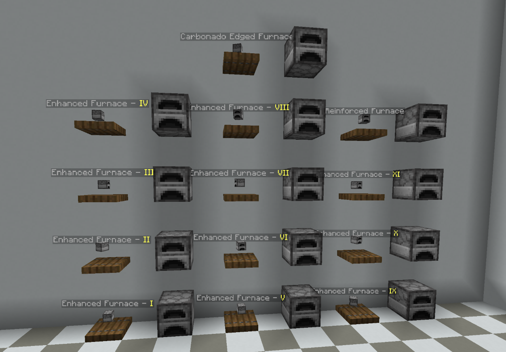<figcaption>
All Enhanced furnace tiers
</figcaption></figure>

|                                                                                                                           -                                                                                                                           |                                                                                                            Enhanced Furnace Tier 1                                                                                                           |                                                                                                                     -                                                                                                                    |
| :---------------------------------------------------------------------------------------------------------------------------------------------------------------------------------------------------------------------------------------------------: | :------------------------------------------------------------------------------------------------------------------------------------------------------------------------------------------------------------------------------------------: | :--------------------------------------------------------------------------------------------------------------------------------------------------------------------------------------------------------------------------------------: |
|                                                                                                                           X                                                                                                                           |    [Steel Ingot](https://2422084179-files.gitbook.io/\~/files/v0/b/gitbook-x-prod.appspot.com/o/spaces%2FXEtLq0casH8SK58Ts6mH%2Fuploads%2FOzfT2zgLOw8Mg69uj5lP%2Fsteelingot1bo.jpg?alt=media\&token=173a6e55-01ee-47b0-a51f-1ef6f74ae6c0)    |                                                                                                                     X                                                                                                                    |
| [Basic Circuit Board](https://2422084179-files.gitbook.io/\~/files/v0/b/gitbook-x-prod.appspot.com/o/spaces%2FXEtLq0casH8SK58Ts6mH%2Fuploads%2F3MRqOpMxQB690dZhDoM1%2Fbasiccircuitboard1bo.jpg?alt=media\&token=28f4ff1a-1add-4334-bb28-0e8eff6c5a5b) |                                                                                                                    Furnace                                                                                                                   | [Heating Coil](https://2422084179-files.gitbook.io/\~/files/v0/b/gitbook-x-prod.appspot.com/o/spaces%2FXEtLq0casH8SK58Ts6mH%2Fuploads%2FGushzYf5l0KlhNtTf8Gp%2Fheatingcoil1bo.jpg?alt=media\&token=31a69312-140a-415b-b56d-209de332f20d) |
|                                                                                                                           X                                                                                                                           | [Electric Motor](https://2422084179-files.gitbook.io/\~/files/v0/b/gitbook-x-prod.appspot.com/o/spaces%2FXEtLq0casH8SK58Ts6mH%2Fuploads%2FgMNVXV7jaj4maigrR0Ti%2Felectricmotor1bo.jpg?alt=media\&token=ce06105e-01dc-4ee8-88e7-ac51ce7f3a93) |                                                                                                                     X                                                                                                                    |

|                                                                                                                           -                                                                                                                           |                                                                                                         Enhanced Furnace Tiers 2 - 11                                                                                                        |                                                                                                                     -                                                                                                                    |
| :---------------------------------------------------------------------------------------------------------------------------------------------------------------------------------------------------------------------------------------------------: | :------------------------------------------------------------------------------------------------------------------------------------------------------------------------------------------------------------------------------------------: | :--------------------------------------------------------------------------------------------------------------------------------------------------------------------------------------------------------------------------------------: |
|                                                                                                                           X                                                                                                                           |    [Steel Ingot](https://2422084179-files.gitbook.io/\~/files/v0/b/gitbook-x-prod.appspot.com/o/spaces%2FXEtLq0casH8SK58Ts6mH%2Fuploads%2FOzfT2zgLOw8Mg69uj5lP%2Fsteelingot1bo.jpg?alt=media\&token=173a6e55-01ee-47b0-a51f-1ef6f74ae6c0)    |                                                                                                                     X                                                                                                                    |
| [Basic Circuit Board](https://2422084179-files.gitbook.io/\~/files/v0/b/gitbook-x-prod.appspot.com/o/spaces%2FXEtLq0casH8SK58Ts6mH%2Fuploads%2F3MRqOpMxQB690dZhDoM1%2Fbasiccircuitboard1bo.jpg?alt=media\&token=28f4ff1a-1add-4334-bb28-0e8eff6c5a5b) |                                                                                                  
Enhanced Furnace  (previous tier)
                                                                                                 | [Heating Coil](https://2422084179-files.gitbook.io/\~/files/v0/b/gitbook-x-prod.appspot.com/o/spaces%2FXEtLq0casH8SK58Ts6mH%2Fuploads%2FGushzYf5l0KlhNtTf8Gp%2Fheatingcoil1bo.jpg?alt=media\&token=31a69312-140a-415b-b56d-209de332f20d) |
|                                                                                                                           X                                                                                                                           | [Electric Motor](https://2422084179-files.gitbook.io/\~/files/v0/b/gitbook-x-prod.appspot.com/o/spaces%2FXEtLq0casH8SK58Ts6mH%2Fuploads%2FgMNVXV7jaj4maigrR0Ti%2Felectricmotor1bo.jpg?alt=media\&token=ce06105e-01dc-4ee8-88e7-ac51ce7f3a93) |                                                                                                                     X                                                                                                                    |

|                                                                                                                              -                                                                                                                             |                                                                                                                     Reinforced Furnace                                                                                                                     |                                                                                                                              -                                                                                                                             |
| :--------------------------------------------------------------------------------------------------------------------------------------------------------------------------------------------------------------------------------------------------------: | :--------------------------------------------------------------------------------------------------------------------------------------------------------------------------------------------------------------------------------------------------------: | :--------------------------------------------------------------------------------------------------------------------------------------------------------------------------------------------------------------------------------------------------------: |
| [Reinforced ally ingot](https://2422084179-files.gitbook.io/\~/files/v0/b/gitbook-x-prod.appspot.com/o/spaces%2FXEtLq0casH8SK58Ts6mH%2Fuploads%2FUIIXEz9SprPLSgrvN0Xx%2Freinforcedalloyingot1bo.jpg?alt=media\&token=7e61a6ff-cc58-4ea9-b6e1-8c104394e538) |    [Basic Circuit Board](https://2422084179-files.gitbook.io/\~/files/v0/b/gitbook-x-prod.appspot.com/o/spaces%2FXEtLq0casH8SK58Ts6mH%2Fuploads%2F3MRqOpMxQB690dZhDoM1%2Fbasiccircuitboard1bo.jpg?alt=media\&token=28f4ff1a-1add-4334-bb28-0e8eff6c5a5b)   | [Reinforced ally ingot](https://2422084179-files.gitbook.io/\~/files/v0/b/gitbook-x-prod.appspot.com/o/spaces%2FXEtLq0casH8SK58Ts6mH%2Fuploads%2FUIIXEz9SprPLSgrvN0Xx%2Freinforcedalloyingot1bo.jpg?alt=media\&token=7e61a6ff-cc58-4ea9-b6e1-8c104394e538) |
|          [Heating Coil](https://2422084179-files.gitbook.io/\~/files/v0/b/gitbook-x-prod.appspot.com/o/spaces%2FXEtLq0casH8SK58Ts6mH%2Fuploads%2FGushzYf5l0KlhNtTf8Gp%2Fheatingcoil1bo.jpg?alt=media\&token=31a69312-140a-415b-b56d-209de332f20d)          | [Enhanced Furnace Tier 11](https://2422084179-files.gitbook.io/\~/files/v0/b/gitbook-x-prod.appspot.com/o/spaces%2FXEtLq0casH8SK58Ts6mH%2Fuploads%2FfLDZAaDRzvKs675cfl9m%2Fenhancedfurnance11bo.jpg?alt=media\&token=ceaea2e7-04db-484d-88ac-6a69c3579149) |          [Heating Coil](https://2422084179-files.gitbook.io/\~/files/v0/b/gitbook-x-prod.appspot.com/o/spaces%2FXEtLq0casH8SK58Ts6mH%2Fuploads%2FGushzYf5l0KlhNtTf8Gp%2Fheatingcoil1bo.jpg?alt=media\&token=31a69312-140a-415b-b56d-209de332f20d)          |
| [Reinforced ally ingot](https://2422084179-files.gitbook.io/\~/files/v0/b/gitbook-x-prod.appspot.com/o/spaces%2FXEtLq0casH8SK58Ts6mH%2Fuploads%2FUIIXEz9SprPLSgrvN0Xx%2Freinforcedalloyingot1bo.jpg?alt=media\&token=7e61a6ff-cc58-4ea9-b6e1-8c104394e538) |        [Electric Motor](https://2422084179-files.gitbook.io/\~/files/v0/b/gitbook-x-prod.appspot.com/o/spaces%2FXEtLq0casH8SK58Ts6mH%2Fuploads%2FgMNVXV7jaj4maigrR0Ti%2Felectricmotor1bo.jpg?alt=media\&token=ce06105e-01dc-4ee8-88e7-ac51ce7f3a93)        | [Reinforced ally ingot](https://2422084179-files.gitbook.io/\~/files/v0/b/gitbook-x-prod.appspot.com/o/spaces%2FXEtLq0casH8SK58Ts6mH%2Fuploads%2FUIIXEz9SprPLSgrvN0Xx%2Freinforcedalloyingot1bo.jpg?alt=media\&token=7e61a6ff-cc58-4ea9-b6e1-8c104394e538) |

|                                                                                                                     -                                                                                                                    |                                                                                                                Carbonado-Edged Furnace                                                                                                                |                                                                                                                     -                                                                                                                    |
| :--------------------------------------------------------------------------------------------------------------------------------------------------------------------------------------------------------------------------------------: | :---------------------------------------------------------------------------------------------------------------------------------------------------------------------------------------------------------------------------------------------------: | :--------------------------------------------------------------------------------------------------------------------------------------------------------------------------------------------------------------------------------------: |
|    [Carbonado](https://2422084179-files.gitbook.io/\~/files/v0/b/gitbook-x-prod.appspot.com/o/spaces%2FXEtLq0casH8SK58Ts6mH%2Fuploads%2FS2Sx5VrzMUOWPpHDdoqu%2Fcarbonado1bo.jpg?alt=media\&token=4be622bb-4db3-4f99-a456-ccf745bedcd7)   | [Basic Circuit Board](https://2422084179-files.gitbook.io/\~/files/v0/b/gitbook-x-prod.appspot.com/o/spaces%2FXEtLq0casH8SK58Ts6mH%2Fuploads%2F3MRqOpMxQB690dZhDoM1%2Fbasiccircuitboard1bo.jpg?alt=media\&token=28f4ff1a-1add-4334-bb28-0e8eff6c5a5b) |    [Carbonado](https://2422084179-files.gitbook.io/\~/files/v0/b/gitbook-x-prod.appspot.com/o/spaces%2FXEtLq0casH8SK58Ts6mH%2Fuploads%2FS2Sx5VrzMUOWPpHDdoqu%2Fcarbonado1bo.jpg?alt=media\&token=4be622bb-4db3-4f99-a456-ccf745bedcd7)   |
| [Heating Coil](https://2422084179-files.gitbook.io/\~/files/v0/b/gitbook-x-prod.appspot.com/o/spaces%2FXEtLq0casH8SK58Ts6mH%2Fuploads%2FGushzYf5l0KlhNtTf8Gp%2Fheatingcoil1bo.jpg?alt=media\&token=31a69312-140a-415b-b56d-209de332f20d) | [Reinforced Furnace](https://2422084179-files.gitbook.io/\~/files/v0/b/gitbook-x-prod.appspot.com/o/spaces%2FXEtLq0casH8SK58Ts6mH%2Fuploads%2FtWOK00hGC6wCNj3qjDmz%2Freinforcedfurnance1bo.jpg?alt=media\&token=16abc424-b310-484a-abed-6949f5664ab1) | [Heating Coil](https://2422084179-files.gitbook.io/\~/files/v0/b/gitbook-x-prod.appspot.com/o/spaces%2FXEtLq0casH8SK58Ts6mH%2Fuploads%2FGushzYf5l0KlhNtTf8Gp%2Fheatingcoil1bo.jpg?alt=media\&token=31a69312-140a-415b-b56d-209de332f20d) |
|    [Carbonado](https://2422084179-files.gitbook.io/\~/files/v0/b/gitbook-x-prod.appspot.com/o/spaces%2FXEtLq0casH8SK58Ts6mH%2Fuploads%2FS2Sx5VrzMUOWPpHDdoqu%2Fcarbonado1bo.jpg?alt=media\&token=4be622bb-4db3-4f99-a456-ccf745bedcd7)   |      [Electric Motor](https://2422084179-files.gitbook.io/\~/files/v0/b/gitbook-x-prod.appspot.com/o/spaces%2FXEtLq0casH8SK58Ts6mH%2Fuploads%2FgMNVXV7jaj4maigrR0Ti%2Felectricmotor1bo.jpg?alt=media\&token=ce06105e-01dc-4ee8-88e7-ac51ce7f3a93)     |    [Carbonado](https://2422084179-files.gitbook.io/\~/files/v0/b/gitbook-x-prod.appspot.com/o/spaces%2FXEtLq0casH8SK58Ts6mH%2Fuploads%2FS2Sx5VrzMUOWPpHDdoqu%2Fcarbonado1bo.jpg?alt=media\&token=4be622bb-4db3-4f99-a456-ccf745bedcd7)   |

FUNCTION\
The Enhanced Furnaces work like a Furnace, and have the same recipes as Furnaces.

Unlike the Furnace, there exist 13 tiers of Enhanced Furnaces, which increase the efficiency of the Enhanced Furnace based on their attributes.

* Processing Speed: Smelts items faster.
* Fuel Efficiency: Fuel lasts for longer.
* Luck: Increases the chance of getting double the product per smelted item (works identically to Fortune).

Below, the table compares the efficiency of those attributes to a normal Furnace's.

|       Tier      | Processing Speed | Fuel Efficiency | Luck |
| :-------------: | :--------------: | :-------------: | :--: |
|        1        |      Normal      |      Normal     |   0  |
|        2        |        2x        |      Normal     |   0  |
|        3        |        2x        |        2x       |   0  |
|        4        |        3x        |        2x       |   0  |
|        5        |        3x        |        2x       |  2x  |
|        6        |        3x        |        3x       |  2x  |
|        7        |        4x        |        3x       |  2x  |
|        8        |        4x        |        4x       |  2x  |
|        9        |        5x        |        4x       |  2x  |
|        10       |        5x        |        5x       |  2x  |
|        11       |        5x        |        5x       |  3x  |
|    Reinforced   |        10x       |       10x       |  3x  |
| Carbonado-Edged |        20x       |       10x       |  3x  |

**USE**\
The Enhanced Furnaces have the same interface as the regular Furnace. Place fuel in the fuel slot and an item in the processing slot. After processing, the final items will be placed in the output slot.

## Grind Stone


The Grind Stone is a multi-block, basic Slimefun machine.


<figure>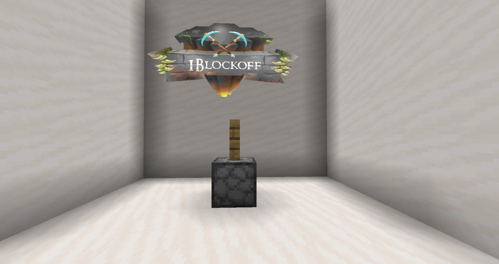<figcaption>
The dispenser is facing upwards
</figcaption></figure>



The Grind Stone is used for crushing basic items and materials, mob items and other similar items efficiently into their products.



Place the items of a recipe inside the Dispenser. Right click on the Oak Fence.



<mark style="color:green;">**Recipe Chest**</mark><mark style="color:green;">:</mark> You can place a normal, single chest next to the Dispenser of this machine, to automatically move any craftePlace the items of a recipe inside the Dispenser. Right click on the Oak Fence.Place the items of a recipe inside the Dispenser. Right click on the Oak Fence.Place the items of a recipe inside the Dispenser. Right click on the Oak Fence.Place the items of a recipe inside the Dispenser. Right click on the Oak Fence.Place the items of a recipe inside the Dispenser. Right click on the Oak Fence.Place the items of a recipe inside the Dispenser. Right click on the Oak Fence.Place the items of a recipe inside the Dispenser. Right click on the Oak Fence.d items into the chest.



|       INPUT       |        OUTPUT       |
| :---------------: | :-----------------: |
|        Dirt       |     Stone chunk     |
|    Cobblestone    |        Gravel       |
|      Andesite     |        Gravel       |
|      Diorite      |        Gravel       |
|      Granite      |        Gravel       |
|  Block of Quartz  |   4 Nether quartz   |
|     Sandstone     |        4 Sand       |
|   Red Sandstone   |      4 Red sand     |
| Prismarine Bricks |     2 Prismarine    |
|     Prismarine    | 4 Prismarine shards |
| Nether wart block |    9 Nether wart    |
|     Blaze rod     |    4 Blaze powder   |
|        Bone       |     4 Bone meal     |
|     Bone block    |     9 Bone meal     |
|    Eye of Ender   |    2 Ender lump I   |
|   Ender lump II   |    4 Ender lump I   |
|   Ender Lump III  |   4 Ender lump II   |
|    Nether wart    |   2 Magical lump I  |
|  Magical lump II  |   4 Magical lump I  |
|  Magical lump III |  4 Magical lump II  |
|        Corn       |       Cornmeal      |
|      Diamond      |       4 Carbon      |
|        Egg        |         Mayo        |
|        Ice        |      4 Ice cube     |
|    Mustard seed   |       Mustard       |
|       Wheat       |     Wheat flour     |

## Juicer


The Juicer is a multi-block, basic Slimefun machine.


<figure>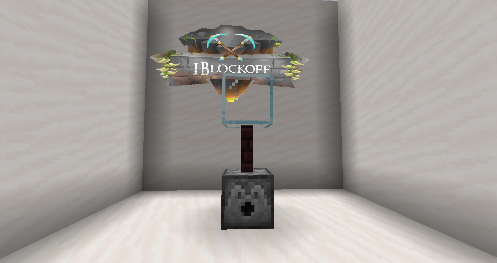<figcaption></figcaption></figure>



Crafts various juices out of fruit.



Place the items of a recipe inside the Dispenser. Right click on the Nether Brick Fence.

Note that the Juicer does not require a Glass Bottle in order to craft its recipes.



<mark style="color:green;">**Recipe Chest**</mark><mark style="color:green;">:</mark> You can place a normal, single chest next to the Dispenser of this machine, to automatically move any crafted items into the chest.



|     INPUT    |       OUTPUT       |
| :----------: | :----------------: |
|     Apple    |     Apple juice    |
|    Carrot    |    Carrot juice    |
|     Melon    |     Melon juice    |
|    Pumpkin   |    Pumpkin juice   |
|  Sweet berry |  Sweet berry juice |
| Golden apple | Golden apple juice |

## Makeshift Smeltry


The Makeshift Smeltery is a multi-block, basic Slimefun machine.


<figure><figcaption>
The dispenser is facing upwards
</figcaption></figure>



The Makeshift Smeltery is a downgraded version of the smeltry in which you can only craft <mark style="color:orange;">**basic ingots**</mark> (ingots that are crafted from a dust).



Place the correct items of a recipe inside the Dispenser. Right click on the wooden Fence.\
\
The Makeshift Smeltery requires a fire under its Dispenser. The fire will occasionally go off after a few operations.



<mark style="color:green;">**Recipe Chest**</mark><mark style="color:green;">:</mark> You can place a normal, single chest next to the Dispenser of this machine, to automatically move any crafted items into the chest.\
\




|     INPUT     |        OUTPUT        |
| :-----------: | :------------------: |
| Aluminum dust |    Aluminum ingot    |
|  Copper dust  |     Copper ingot     |
|   Gold dust   | Gold ingot (4-carat) |
|   Iron dust   |      Iron ingot      |
|   Lead dust   |      Lead ingot      |
|  Silver dust  |     Silver ingot     |
|    Tin dust   |       Tin ingot      |
|   Zinc dust   |      Zinc ingot      |

## Ore Crusher


The Ore Crusher is a multi-block, basic Slimefun machine.


<figure>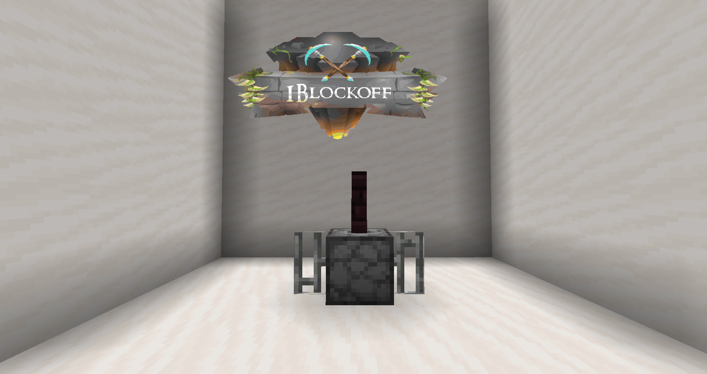<figcaption>
the dispenser is facing upwards
</figcaption></figure>



The Ore Crusher is used for crushing ores and resources.



Place the items of a recipe inside the Dispenser. Right click on the Nether Brick Fence.



<mark style="color:green;">**Recipe Chest**</mark><mark style="color:green;">:</mark> You can place a normal, single chest next to the Dispenser of this machine, to automatically move any crafted items into the chest.



|         INPUT         |        OUTPUT        |
| :-------------------: | :------------------: |
|     8 Cobblestone     |         Sand         |
|         Gravel        |         Sand         |
|        8 Flint        |         Sand         |
|      Magma block      |        Sulfate       |
|      16 Netherack     |        Sulfate       |
|       Sifted ore      |      Crushed ore     |
|      Crushed ore      |    Pulverized ore    |
|    Pure ore cluster   | Tiny pile of uranium |
|         Carbon        |        8 Coal        |
|   Compressed carbon   |       4 Carbon       |
|       Raw copper      |      Copper dust     |
|        Raw iron       |       Iron dust      |
|        Raw gold       |       Gold dust      |
|        Coal ore       |        2 Coal        |
|      Diamond ore      |       2 Diamond      |
|      Emerald ore      |       2 Emerald      |
|   Gilded blackstone   |     8 Gold nugget    |
|        Gold ore       |      2 Gold dust     |
|        Iron ore       |      2 Iron dust     |
|    Lapis lazuli ore   |    14 Lapis lazuli   |
|    Nether gold ore    |     8 Gold nugget    |
|   Nether quartz ore   |     8 Gold nugget    |
|      Redstone ore     |    8 Redstone dust   |
|  Gold ingot (4-carat) |      1 gold dust     |
|  Gold ingot (6-carat) |      2 gold dust     |
|  Gold ingot (8-carat) |      2 gold dust     |
| Gold ingot (10-carat) |      3 gold dust     |
| Gold ingot (12-carat) |      3 gold dust     |
| Gold ingot (14-carat) |      4 gold dust     |
| Gold ingot (16-carat) |      4 gold dust     |
| Gold ingot (18-carat) |      5 gold dust     |
| Gold ingot (20-carat) |      5 gold dust     |
| Gold ingot (22-carat) |      6 gold dust     |
| Gold ingot (24-carat) |      6 gold dust     |

## Ore Washer


The Ore Washer is a multi-block, basic Slimefun machine.


<figure>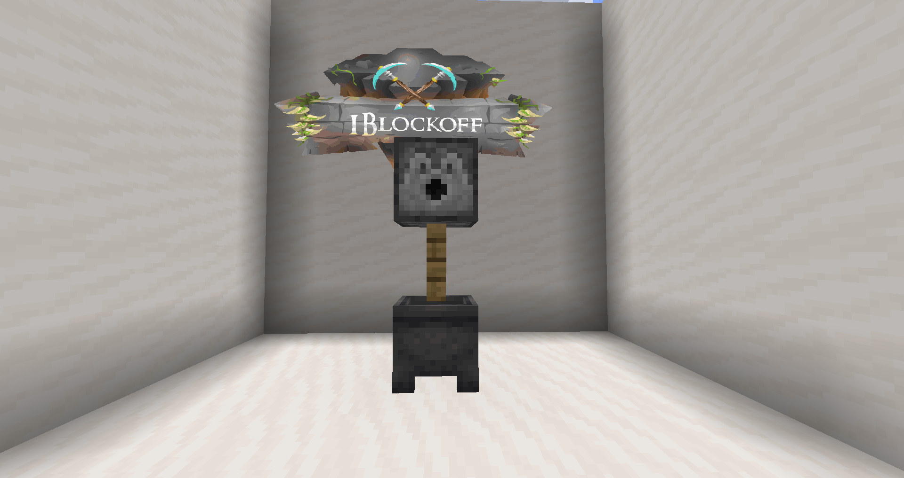<figcaption></figcaption></figure>



The Ore Washer washes raw items to produce important primary resources. It is mainly used for acquiring dusts.



Place the items of a recipe inside the Dispenser. Right click on the Oak Fence.\
\
When crafting dusts out of Sifted Ore, the Ore Washer will <mark style="color:red;">**not**</mark> continue processing more Sifted Ore if its slots are full, regardless of the produced dusts' stacking. Use the machine until it is full, then take the dusts and Stone Chunks out, and repeat the process.



<mark style="color:green;">**Recipe Chest**</mark><mark style="color:green;">:</mark> You can place a normal, single chest next to the Dispenser of this machine, to automatically move any crafted items into the chest.



The 8 Sifted Ore products have a random chance of being crafted. The most common product is Gold Dust, while the least common is Silver Dust.

|      INPUT     |                OUTPUT                |
| :------------: | :----------------------------------: |
|   Sifted ore   |  
Aluminum dust Stone chunk
 |
|   Sifted ore   |   
Copper dust Stone chunk
  |
|   Sifted ore   |    
Gold dust Stone chunk
   |
|   Sifted ore   |    
Iron dust Stone chunk
   |
|   Sifted ore   |    
Lead dust Stone chunk
   |
|   Sifted ore   |   
Silver dust Stone chunk
  |
|   Sifted ore   |    
Tin dust Stone chunk
    |
|   Sifted ore   |    
Zinc dust Stone chunk
   |
|   Sifted ore   |   
Copper dust Stone chunk
  |
|   Sifted ore   | 
Magnesium dust Stone chunk
 |
|     2 Sand     |                 Salt                 |
| Pulverized ore |           Pure ore cluster           |

## Pressure Chamber


The Pressure Chamber is a multi-block, basic Slimefun machine.


<figure>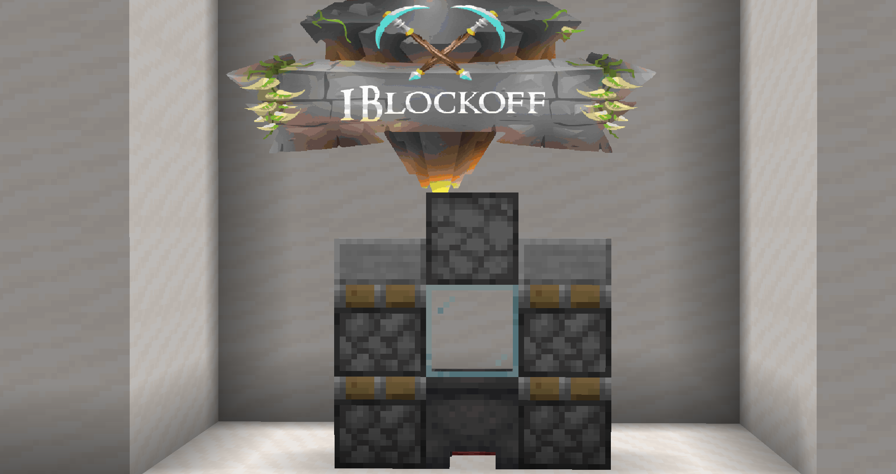<figcaption>
The dispenser is facing downwards
</figcaption></figure>



The Pressure Chamber is used for refining resources.



Place the items of a recipe inside the Dispenser. Right click on the Cauldron.



<mark style="color:green;">**Recipe Chest**</mark><mark style="color:green;">:</mark> You can place a normal, single chest next to the Dispenser of this machine, to automatically move any crafted items into the chest



|     INPUT     |       OUTPUT      |
| :-----------: | :---------------: |
|  Carbon Chunk | Synthetic Diamond |
| Raw Carbonado |     Carbonado     |

## Smeltry


The Smeltery is a multi-block, basic Slimefun machine.


<figure>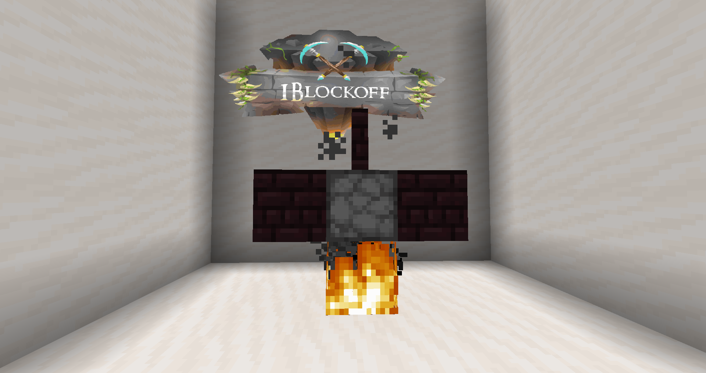<figcaption></figcaption></figure>



The Smeltery is used for crafting <mark style="color:yellow;">**basic ingots**</mark><mark style="color:yellow;">,</mark> <mark style="color:yellow;"></mark><mark style="color:yellow;">**alloy ingots**</mark><mark style="color:yellow;">,</mark> <mark style="color:yellow;"></mark><mark style="color:yellow;">**minerals**</mark><mark style="color:yellow;">,</mark> and <mark style="color:yellow;">**Magnets**</mark>.

These products are some of the fundamental resources used in Slimefun production.

There also exists a version of the Smeltery that is only able to smelt dusts into their basic ingot—the Makeshift smeltry



Place items in the correct pattern of a recipe inside the Dispenser, as shown in the Slimefun guide. Right click on the Nether Brick Fence.\
\
The Smeltery requires a fire under its Dispenser. The fire will occasionally go off after a few operations. In order for the fire not to go off, an **Automatic Ignition Chamber** is required. Placing the Automatic Ignition Chamber down next to the Smeltery's Dispenser and supplying it with Flint and Steel means that the Smeltery's fire will never go out, unless the Flint and Steel runs out. Note that the <mark style="color:yellow;">Automatic Ignition Chamber</mark> is not affected by the plot's fire spread setting—you only need to light the fire once, if the Flint and Steel never runs out.



<mark style="color:green;">**Recipe Chest**</mark><mark style="color:green;">:</mark> You can place a normal, single chest next to the Dispenser of this machine, to automatically move any crafted items into the chest.



|      INPUT      |        OUTPUT        |
| :-------------: | :------------------: |
|    Iron dust    |      Iron ingot      |
|   Copper dust   |     Copper ingot     |
|     Tin dust    |       Tin ingot      |
|   Silver dust   |     Silver ingot     |
|    Lead dust    |      Lead ingot      |
|  Aluminum dust  |    Aluminum ingot    |
|    Zinc dust    |      Zinc ingot      |
|    Magnesium    |    Magnesium ingot   |
|    Gold dust    | Gold ingot (4-carat) |
| Block of Quartz |        Silicon       |
|  Chocolate Milk |     Hot Chocolate    |

**ALLOY INGOTS**

|           -          | Reinforced Alloy Ingot |            -            |
| :------------------: | :--------------------: | :---------------------: |
| Damascus steel ingot |     Hardened metal     | Corinthian bronze ingot |
|     Solder ingot     |      Billon ingot      |  Gold ingot (24-carat)  |
|           X          |            X           |            X            |

|        -       | Redstone Ally ingot |       -      |
| :------------: | :-----------------: | :----------: |
|  Redstone dust |  Block of redstone  | Ferrosilicon |
| Hardened metal |          X          |       X      |
|        X       |          X          |       X      |

|           -           |  Hardened Metal |         -         |
| :-------------------: | :-------------: | :---------------: |
|  Damascus Steel ingot | Duralumin ingot | Compressed carbon |
| Aluminum bronze ingot |        X        |         X         |
|           X           |        X        |         X         |

|           -           | Gilded Iron |  -  |
| :-------------------: | :---------: | :-: |
| Gold ingot (24-carat) |  Iron dust  |  X  |
|           X           |      X      |  X  |
|           X           |      X      |  X  |

|      -     | Ferrosilicon |    -    |
| :--------: | :----------: | :-----: |
| Iron ingot |   Iron dust  | Silicon |
|      X     |       X      |    X    |
|      X     |       X      |    X    |

|      -      | Damascus steel ingot |    -   |
| :---------: | :------------------: | :----: |
| Steel ingot |       Iron dust      | Carbon |
|  Iron ingot |           X          |    X   |
|      X      |           X          |    X   |

|       -       | Aluminum brass ingot |        -       |
| :-----------: | :------------------: | :------------: |
| Aluminum dust |     Bronze ingot     | Aluminum ingot |
|       X       |           X          |        X       |
|       X       |           X          |        X       |

|       -      | Corinthian bronze ingot |      -      |
| :----------: | :---------------------: | :---------: |
|  Silver dust |        Gold dust        | Copper dust |
| Bronze ingot |            X            |      X      |
|       X      |            X            |      X      |

|     -     | Steel ingot |      -     |
| :-------: | :---------: | :--------: |
| Iron dust |    Carbon   | Iron ingot |
|     X     |      X      |      X     |
|     X     |      X      |      X     |

|       -       | Duralumin Ingot |        -       |
| :-----------: | :-------------: | :------------: |
| Aluminum dust |   Copper dust   | Aluminum ingot |
|       X       |        X        |        X       |
|       X       |        X        |        X       |

|     -     | Nickel ingot |      -      |
| :-------: | :----------: | :---------: |
| Iron dust |  Iron ingot  | Copper dust |
|     X     |       X      |      X      |
|     X     |       X      |      X      |

|     -     | Cobalt ingot |       -      |
| :-------: | :----------: | :----------: |
| Iron dust |  Copper dust | Nickel ingot |
|     X     |       X      |       X      |
|     X     |       X      |       X      |

|      -      | Billon ingot |       -      |
| :---------: | :----------: | :----------: |
| Silver dust |  Copper dust | Silver ingot |
|      X      |       X      |       X      |
|      X      |       X      |       X      |

|     -     | Solder ingot |      -     |
| :-------: | :----------: | :--------: |
| Lead dust |   Tin dust   | Lead ingot |
|     X     |       X      |      X     |
|     X     |       X      |      X     |

**CARAT GOLD INGOTS**

|     -     |   Gold ingot (4-24 carat)   |  -  |
| :-------: | :-------------------------: | :-: |
| Gold dust | Gold ingot (previous carat) |  X  |
|     X     |              X              |  X  |
|     X     |              X              |  X  |

**MINERALS**

|         -         | Raw carbonado |      -     |
| :---------------: | :-----------: | :--------: |
| Synthetic diamond |  Carbon chunk | Glass pane |
|         X         |       X       |      X     |
|         X         |       X       |      X     |

|          -         | Synthetic emerald |        -       |
| :----------------: | :---------------: | :------------: |
| Synthetic sapphire |   Aluminum dust   | Aluminum ingot |
|     Glass pane     |         X         |        X       |
|          X         |         X         |        X       |

|        -       | Synthetic sapphire |      -     |
| :------------: | :----------------: | :--------: |
|  Aluminum dust |        Glass       | Glass pane |
| Aluminum ingot |    Lapis lazuli    |      X     |
|        X       |          X         |      X     |

|        -        | Silicon |  -  |
| :-------------: | :-----: | :-: |
| Block of quartz |    X    |  X  |
|        X        |    X    |  X  |
|        X        |    X    |  X  |

**OTHER**

|       -      |     Magnet    |     -     |
| :----------: | :-----------: | :-------: |
| Nickel ingot | Aluminum dust | Iron dust |
| Cobalt ingot |               |           |
|              |               |           |

## Table Saw


The Table Saw is a multi-block, basic Slimefun machine.


<figure>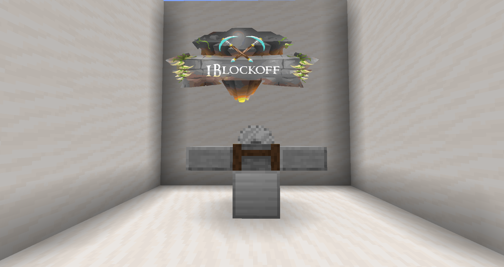<figcaption></figcaption></figure>



The Table Saw handles wooden materials. It allows you to get double the number of wooden products than normal by processing wood.



Hold the correct item of a recipe. Right click on the Stonecutter.

This machine has no inventory. It drops items after processing.



<mark style="color:green;">**Recipe Chest**</mark><mark style="color:green;">:</mark> You can place a normal, single chest next to the Stonecutter, to automatically move any crafted items into the chest.



|          INPUT         |       OUTPUT      |
| :--------------------: | :---------------: |
|      Dark oak log      | 8 Dark oak planks |
|   Stripped birch wood  |   8 Birch planks  |
|   Stripped birch log   |   8 Birch planks  |
|  Stripped spruce wood  |  8 Spruce planks  |
|       Spruce wood      |  8 Spruce planks  |
|   Stripped spruce log  |  8 Spruce planks  |
| Stripped dark oak wood | 8 Dark oak planks |
| Stripped warped hyphae |  8 Warped planks  |
|       Acacia log       |  8 Acacia planks  |
|   Stripped jungle log  |  8 Jungle planks  |
|        Oak wood        |    8 Oak planks   |
|      Mangrove wood     | 8 Mangrove planks |
|  Stripped warped stem  |  8 Warped planks  |
|      Warped hypae      |  8 Warped planks  |
|  Stripped acacia wood  |  8 Acacia planks  |
|       Spruce log       |  8 Spruce planks  |
|    Stripped oak wood   |    8 Oak planks   |
|       Warped stem      |  8 Warped planks  |
|      Crimson Hypae     |  8 Crimson planks |
|      Crimson stem      |  8 Crimson planks |
|       Acacia wood      |  8 Acacia planks  |
|       Birch wood       |   8 Birch planks  |
|      Mangrove log      | 8 Mangrove planks |
| Stripped crimson hypae |  8 Crimson planks |
|  Stripped crimson stem |  8 Crimson planks |
|  Stripped mangrove log | 8 Mangrove planks |
|         Oak log        |    8 Oak planks   |
|       Jungle log       |  8 Jungle planks  |
|  Stripped jungle wood  |  8 Jungle planks  |
|  Stripped dark oak log | 8 Dark oak planks |
|      Dark oak wood     | 8 Dark oak planks |
|   Stripped acacia log  |  8 Acacia planks  |
|    Stripped oak log    |    8 Oak planks   |
| Stripped mangrove wood | 8 Mangrove planks |
|       Jungle wood      |  8 Jungle planks  |
|        Birch log       |   8 Birch planks  |
|     Mangrove planks    |      4 sticks     |
|      Acacia planks     |      4 sticks     |
|     Crimson planks     |      4 sticks     |
|      Spruce planks     |      4 sticks     |
|     Dark oak planks    |      4 sticks     |
|      Warped planks     |      4 sticks     |
|      Jungle planks     |      4 sticks     |
|       Oak planks       |      4 sticks     |
|      Birch planks      |      4 sticks     |
