# Basic Machines

<figure>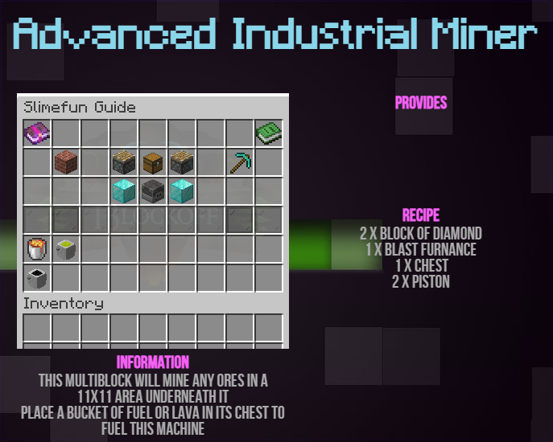<figcaption></figcaption></figure>

 

<figure>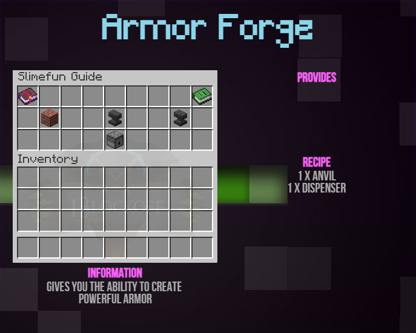<figcaption></figcaption></figure>

 

<figure>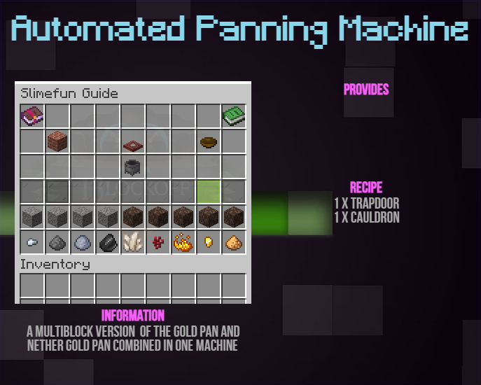<figcaption></figcaption></figure>

 

<figure><figcaption></figcaption></figure>

 

<figure>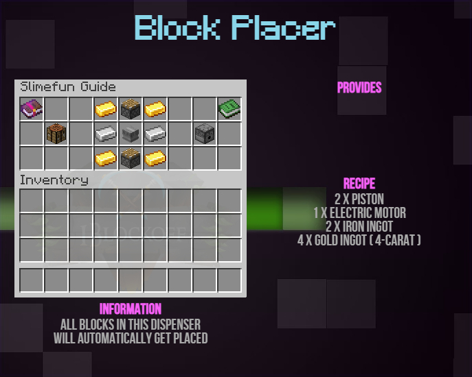<figcaption></figcaption></figure>

 

<figure>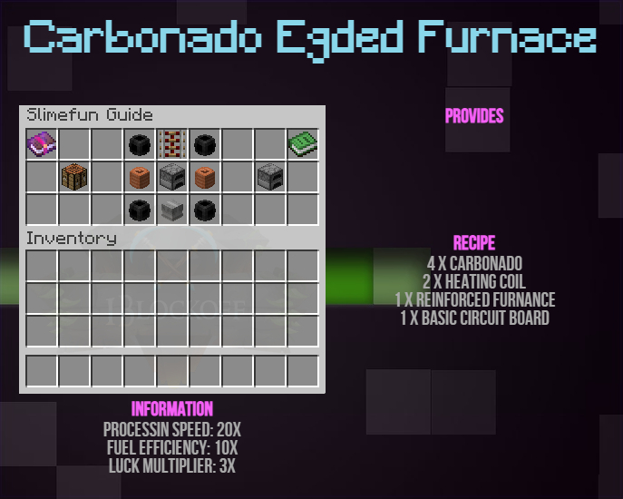<figcaption></figcaption></figure>

 

<figure>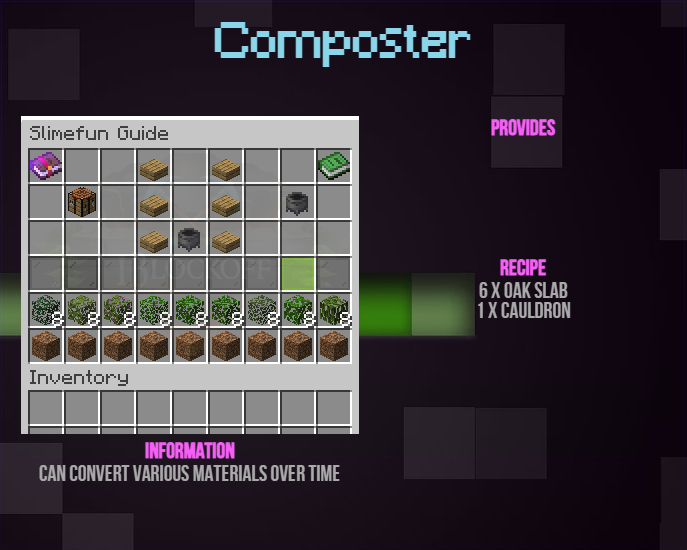<figcaption></figcaption></figure>

 

<figure>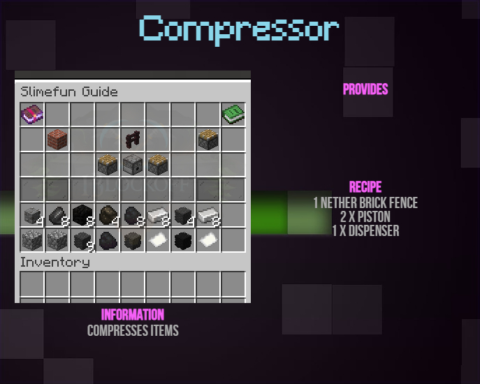<figcaption></figcaption></figure>

 

<figure>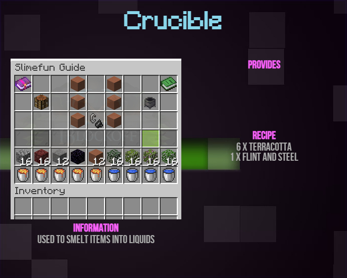<figcaption></figcaption></figure>

 

<figure>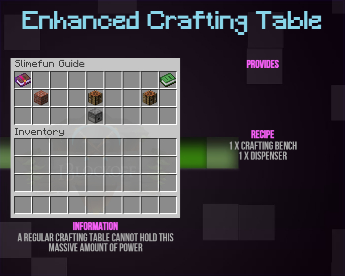<figcaption></figcaption></figure>

 

<figure>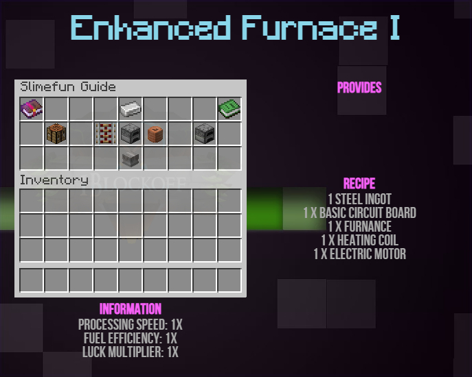<figcaption></figcaption></figure>

 

<figure><figcaption></figcaption></figure>

 

<figure><figcaption></figcaption></figure>

 

<figure>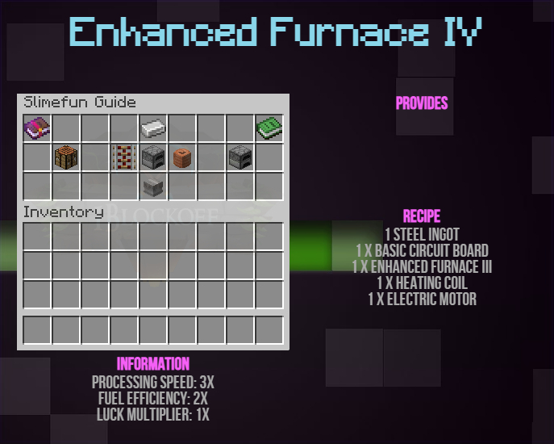<figcaption></figcaption></figure>

 

<figure><figcaption></figcaption></figure>

 

<figure>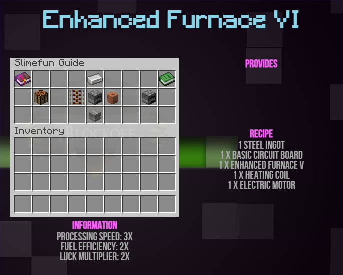<figcaption></figcaption></figure>

 

<figure>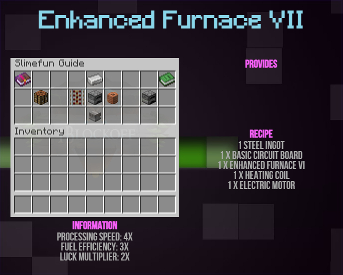<figcaption></figcaption></figure>

 

<figure><figcaption></figcaption></figure>

 

<figure>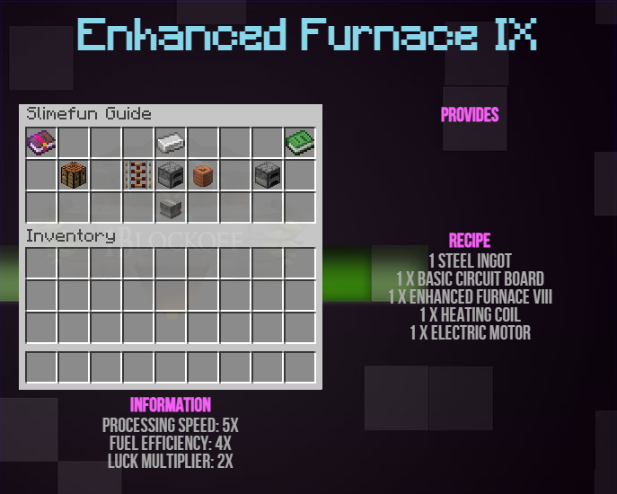<figcaption></figcaption></figure>

 

<figure><figcaption></figcaption></figure>

 

<figure><figcaption></figcaption></figure>

 

<figure>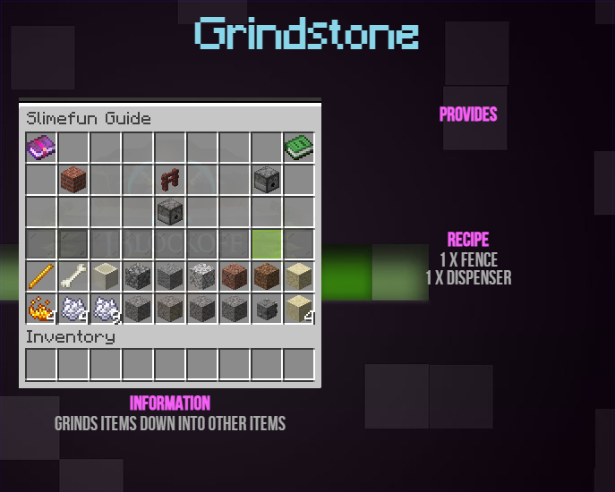<figcaption></figcaption></figure>

 

<figure>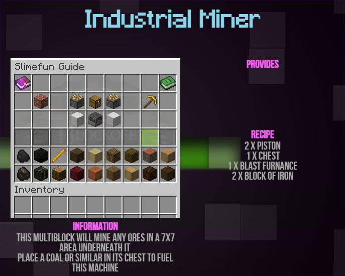<figcaption></figcaption></figure>

 

<figure>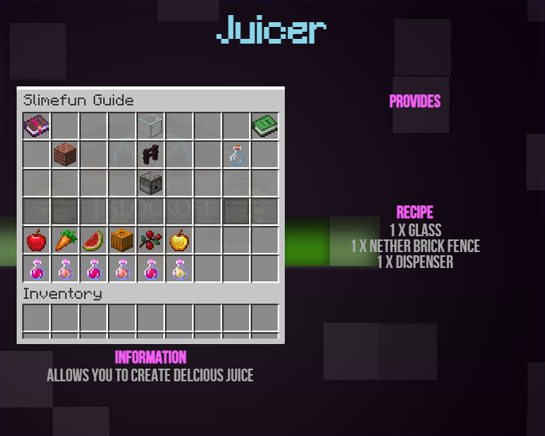<figcaption></figcaption></figure>

 

<figure>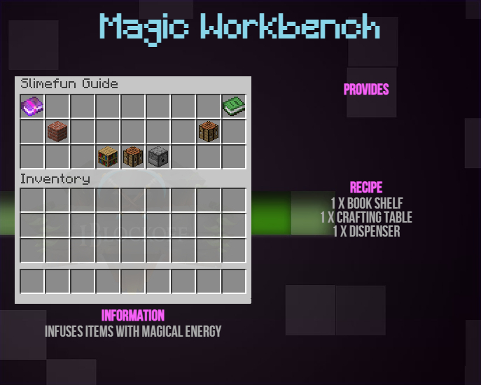<figcaption></figcaption></figure>

 

<figure>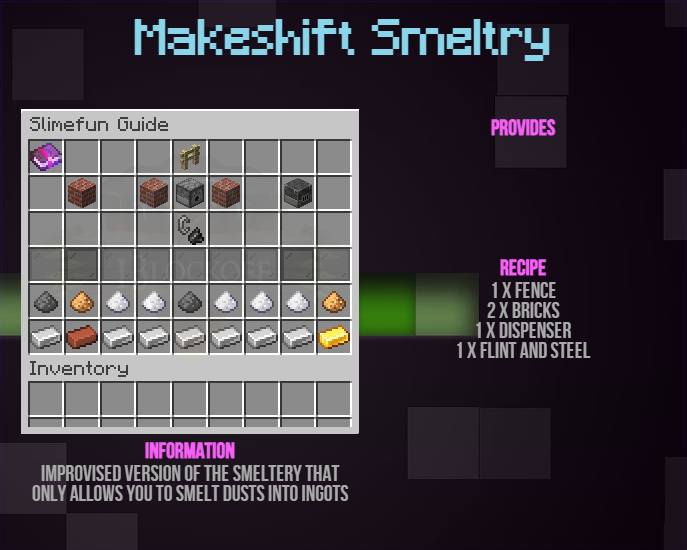<figcaption></figcaption></figure>

 

<figure>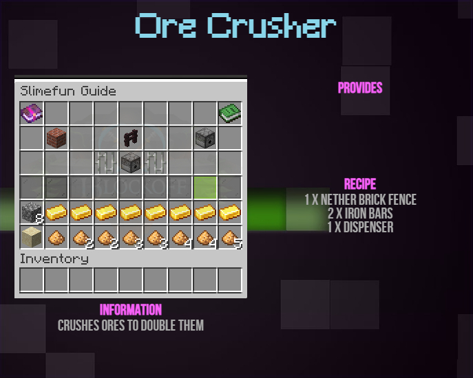<figcaption></figcaption></figure>

 

<figure>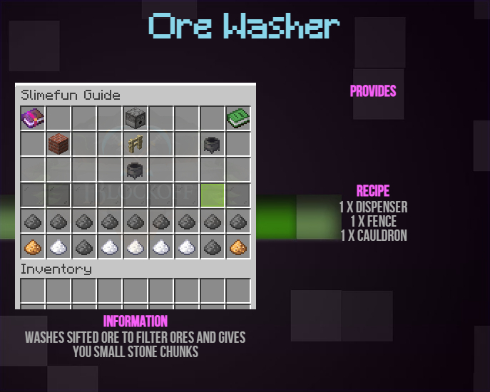<figcaption></figcaption></figure>

 

<figure>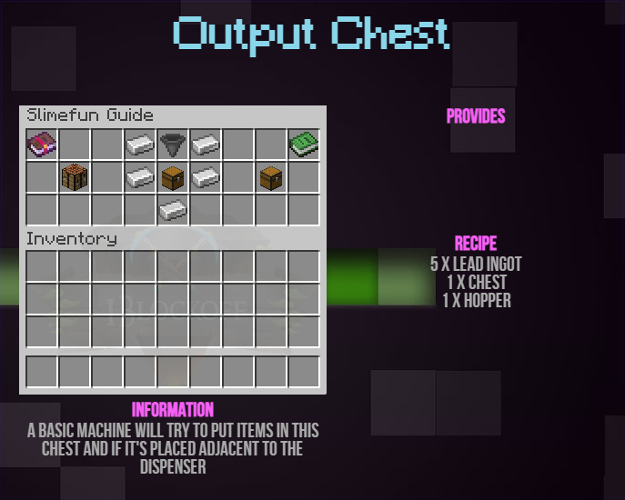<figcaption></figcaption></figure>

 

<figure>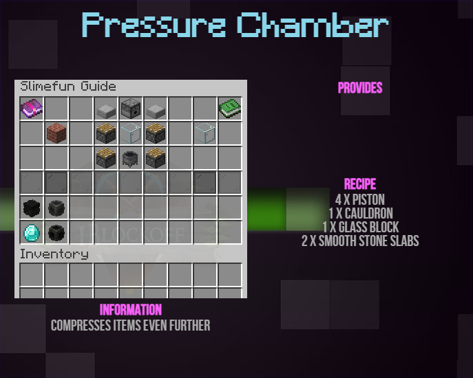<figcaption></figcaption></figure>

 

<figure>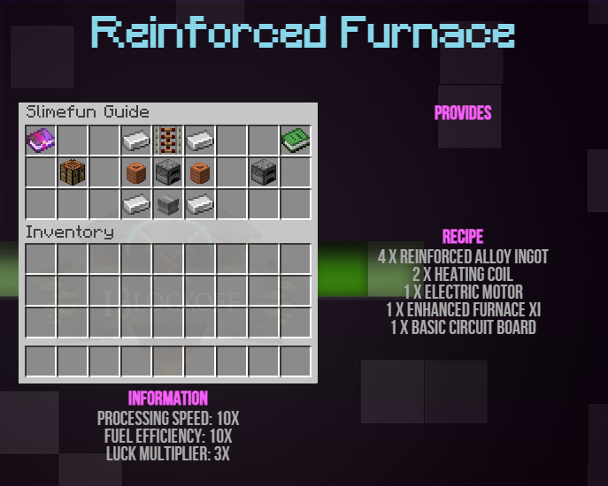<figcaption></figcaption></figure>

 

<figure>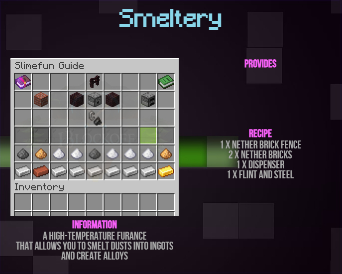<figcaption></figcaption></figure>

 

<figure>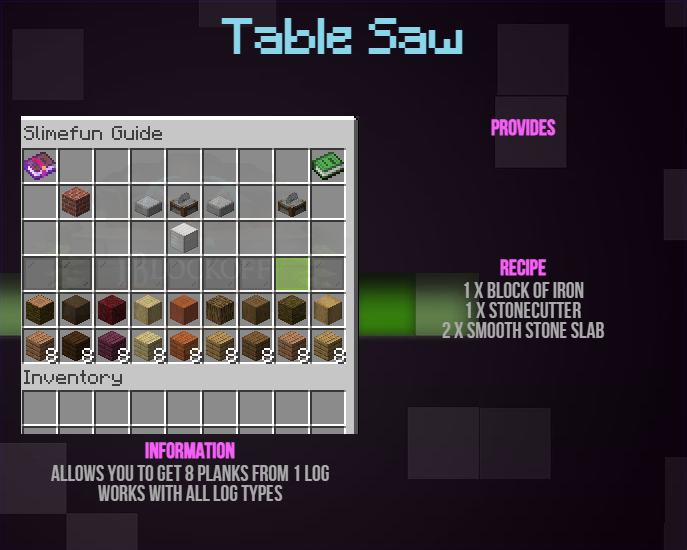<figcaption></figcaption></figure>

