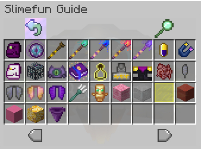
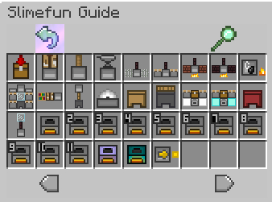

# Resource Pack

As there is no official texture pack for Slimefun and very few actual texture packs compatible for today's version, this is the best one i could find that actually works pretty decent without any issues. The resource pack is based around RaulH22's & HauntedCorpse's textures, It is designed around the Optifine / MCPatcher CIT.

## Features

* Works without the needs of item-models.yml
* Support for dark GUI for [Vanilla Tweak](https://vanillatweaks.net/picker/resource-packs/) users
*   Works with Slimefun's new translation feature

    &#x20;

## Usage

* Vanilla / Forge: You need to install [Optfine](https://optifine.net/downloads)
* Fabric: Install [CIT Resewn](https://1blockoff.xyz/CITResewn-1.1.1+1.19.jar) (file: 1.1.1+1.19) compatible for 1.19.X
* \*DarkGUi: [Slimefun-Beautified-Darkv1.0](https://1blockoff.xyz/Slimefun-Beautified-Dark\_v1.0.zip)
* LightGUI: [Slimefun-Beautified-Light\_v1.0](https://1blockoff.xyz/Slimefun-Beautified-Light\_v1.0.zip)
* \*_Dark version is intended for people who use the Dark UI from VanillaTweaks. If you don't use this, download the light version_

Although this resource is essentially designed for versions 1.18.X, it also works with 1.19.X upon loading the resource pack you will be met with _<mark style="color:orange;">this pack was made for an older version of minecraft and may no longer work correctly</mark>._ just press ok and enjoy your new textures use the    _<mark style="color:green;">**/sf guide**</mark>_ to see the changes. Installation and usage of this texture pack is solely optional and not a requirement for the server.&#x20;

Note: You can still enjoy Slimefun without the texture pack, however it does make it slightly harder trying to identify what each item is on basic vanilla.&#x20;

## How to install Resource Pack


"goto %appdata%, followed by .minecraft and place the zip file in your resourcepack folder"

or

"load minecraft, click on resource packs and then open pack folder and place the zip file in the folder"


## Texture Pack Preview

<figure><figcaption></figcaption></figure>

 

<figure><figcaption></figcaption></figure>

 

<figure><figcaption></figcaption></figure>

 

<figure><figcaption></figcaption></figure>

