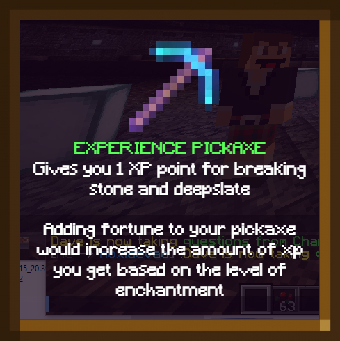
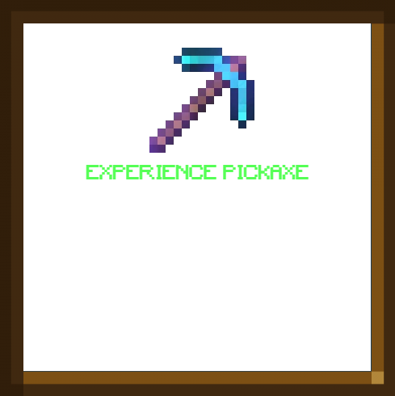
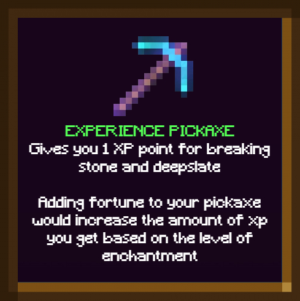
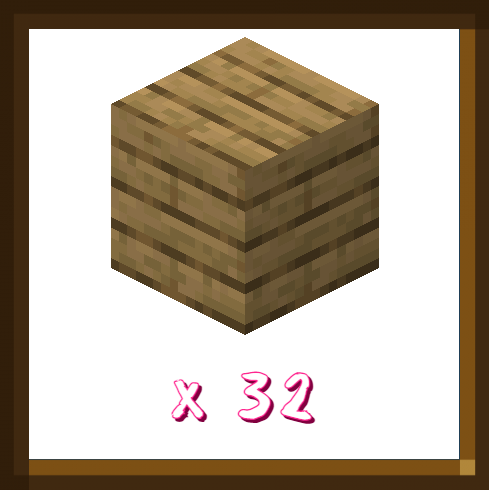
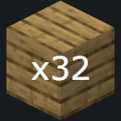
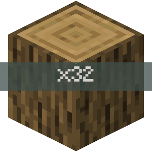
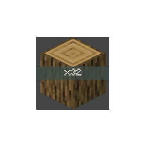
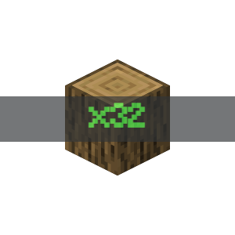
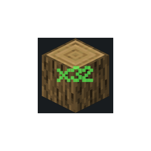
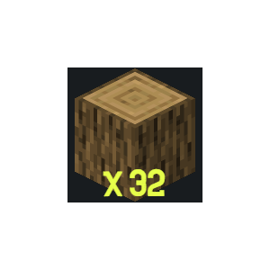

# Voting

<figure><figcaption></figcaption></figure>

<figure><figcaption></figcaption></figure>

 

<figure><figcaption></figcaption></figure>

<figure><figcaption></figcaption></figure>

 

<figure><figcaption></figcaption></figure>

 

<figure><figcaption></figcaption></figure>

 

<figure><figcaption></figcaption></figure>

<figure><figcaption></figcaption></figure>

 

<figure><figcaption></figcaption></figure>

 

<figure><figcaption></figcaption></figure>

 

<figure><figcaption></figcaption></figure>

*
[x] 
    

    <figure><figcaption>
<mark style="color:yellow;"><strong>OAK PLANKS</strong></mark>👍<strong></strong>
</figcaption></figure>

     

    <figure><figcaption></figcaption></figure>

     

    <figure><figcaption></figcaption></figure>

    

*

<figure><figcaption>
Oak Planks
</figcaption></figure>

Testing for image purposes and layout. Page is being worked on

<figure><figcaption></figcaption></figure>

 

<figure><figcaption></figcaption></figure>

 

<figure><figcaption></figcaption></figure>

 

<figure><figcaption></figcaption></figure>

 

<figure><figcaption></figcaption></figure>

<table data-header-hidden><thead><tr><th data-type="files"></th><th data-type="rating" data-max="3"></th><th data-type="select"></th></tr></thead><tbody><tr><td></td><td>3</td><td></td></tr><tr><td></td><td>null</td><td></td></tr><tr><td></td><td>null</td><td></td></tr></tbody></table>





Vote Crate






<figure><figcaption></figcaption></figure>

 

<figure><figcaption></figcaption></figure>

 

<figure><figcaption></figcaption></figure>

 

<figure><figcaption></figcaption></figure>

 

<figure><figcaption></figcaption></figure>

 

<figure><figcaption></figcaption></figure>

 

<figure><figcaption></figcaption></figure>

 

<figure><figcaption></figcaption></figure>

 

<figure><figcaption></figcaption></figure>

 

<figure><figcaption></figcaption></figure>

 

<figure><figcaption></figcaption></figure>





<figure><figcaption></figcaption></figure>

 

<figure><figcaption></figcaption></figure>

 

<figure><figcaption></figcaption></figure>

 

<figure><figcaption></figcaption></figure>

 

<figure><figcaption></figcaption></figure>







