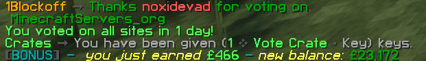
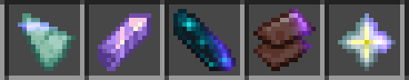

# Rewards

Each and every time you vote for our server, you will be rewarded with in-game money, voting key, vote token and some experience levels. Once you have voted you will see something along the lines of this below.&#x20;

<figure><figcaption></figcaption></figure>

<mark style="color:orange;">**Current Rewards (per vote) - Last updated 21/10/2022**</mark>

|        Reward       |                                                                  Description                                                                  |
| :-----------------: | :-------------------------------------------------------------------------------------------------------------------------------------------: |
| 5 Experience levels |                                                 You will receive 5 experience levels per vote                                                 |
|     £50 - £500      |                                          You will receive a random amount between £50 - £500 per vote                                         |
|      Voting Key     |                                           You will receive x1 voting key to be used with the crates                                           |
|      Vote Token     | You will receive x1 vote token to be used with our [token system](https://1blockoff.gitbook.io/1blockoff-library/towny/economy/voting/tokens) |

<figure><figcaption>
<mark style="color:orange;"><strong>VOTE TOKENS</strong></mark> - <strong>Level one: Prismarine Shard | Level two: Amethyst Shard | Level three: Echo Shard | Level four: Netherite scrap | Jackpot: Nether star</strong>
</figcaption></figure>


In order to see what each vote token does head on over to the [token system](https://1blockoff.gitbook.io/1blockoff-library/towny/economy/voting/tokens) section.\
\
<mark style="color:purple;">**How to get vote tokens if i don't want to vote for the server?**</mark>\ <mark style="color:purple;">****</mark>You're permitted to trade and/or sell your vote tokens to another player providing you're not ripping them off (ie trading 1 vote token for 1 dirt) \
\
Vote tokens are a privilege on 1blockoff as another way for myself to thank you the user for continuing to support our server.  With that being said it can be removed at any given time without notice. So please do not abuse the system and/or try to find exploits. Anyone who is caught exploiting the system for there own personal gain or just trying to be a general asshat will be instantly removed from the server for a prolong period time and depending on the seriousness may result in inventories, bases etc being wiped.&#x20;



